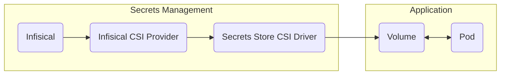

## Overview

The Infisical CSI provider allows you to use Infisical with the [Secrets Store CSI driver](https://secrets-store-csi-driver.sigs.k8s.io) to inject secrets directly into your Kubernetes pods through a volume mount.
In contrast to the [Infisical Kubernetes Operator](https://infisical.com/docs/integrations/platforms/kubernetes), the Infisical CSI provider will allow you to sync Infisical secrets directly to pods, removing the need for Kubernetes secret resources.



## Features

The following features are supported by the Infisical CSI Provider:

- Integration with Secrets Store CSI Driver for direct pod mounting
- Authentication using Kubernetes service accounts via machine identities
- Secret rotation and auto-syncing when enabled via CSI Driver
- Configurable secret paths and file mounting locations
- Installation via Helm

## Prerequisites

The Infisical CSI provider is only supported for Kubernetes clusters with version >= 1.20.

## Limitations

Currently, the Infisical CSI provider only supports static secrets.

## Deploy to Kubernetes cluster

### Install Secrets Store CSI Driver

In order to use the Infisical CSI provider, you will first have to install the [Secrets Store CSI driver](https://secrets-store-csi-driver.sigs.k8s.io/getting-started/installation) to your cluster. It is important that you define
the audience value for token requests as demonstrated below. The Infisical CSI provider will **NOT WORK** if this is not set.

```bash
helm repo add secrets-store-csi-driver https://kubernetes-sigs.github.io/secrets-store-csi-driver/charts
```

```bash
helm install csi secrets-store-csi-driver/secrets-store-csi-driver \
--namespace=kube-system \
--set "tokenRequests[0].audience=infisical" \
--set enableSecretRotation=true \
--set rotationPollInterval=2m \
--set "syncSecret.enabled=true" \
```

The flags configure the following:

- `tokenRequests[0].audience=infisical`: Configures authentication for the CSI provider (required)
- `enableSecretRotation=true`: Enables automatic secret updates from Infisical
- `rotationPollInterval=2m`: Checks for secret updates every 2 minutes
- `syncSecret.enabled=true`: Enables syncing secrets to Kubernetes secrets (optional)

If you do not wish to use the secret rotation feature of the secrets store CSI driver, you can omit the `enableSecretRotation` and the `rotationPollInterval` flags.
Do note that by default, secrets from Infisical are only fetched and mounted during pod creation. If there are any changes made to the secrets in Infisical,
they will not propagate to the pods unless secret rotation is enabled for the CSI driver.

### Install Infisical CSI Provider

You would then have to install the Infisical CSI provider to your cluster.

**Install the latest Infisical Helm repository**

```bash
helm repo add infisical-helm-charts 'https://dl.cloudsmith.io/public/infisical/helm-charts/helm/charts/'

helm repo update
```

**Install the Helm Chart**

```bash
helm install infisical-csi-provider infisical-helm-charts/infisical-csi-provider
```

For a list of all supported arguments for the helm installation, you can run the following:

```bash
helm show values infisical-helm-charts/infisical-csi-provider
```

### Authentication

In order for the Infisical CSI provider to pull secrets from your Infisical project, you will have to configure
a machine identity with [Kubernetes authentication](https://infisical.com/docs/documentation/platform/identities/kubernetes-auth) configured with your cluster.
You can refer to the documentation for setting it up [here](https://infisical.com/docs/documentation/platform/identities/kubernetes-auth#guide).

### Creating Secret Provider Class

With the Secrets Store CSI driver and the Infisical CSI provider installed, create a Kubernetes [SecretProviderClass](https://secrets-store-csi-driver.sigs.k8s.io/concepts.html#secretproviderclass) resource to establish
the connection between the CSI driver and the Infisical CSI provider for secret retrieval. You can create as much Secret Provider Classes as needed for your cluster.

```yaml
apiVersion: secrets-store.csi.x-k8s.io/v1
kind: SecretProviderClass
metadata:
  name: my-infisical-app-csi-provider
spec:
  provider: infisical
  parameters:
    infisicalUrl: "https://app.infisical.com"
    identityId: "ad2f8c67-cbe2-417a-b5eb-1339776ec0b3"
    projectId: "09eda1f8-85a3-47a9-8a6f-e27f133b2a36"
    envSlug: "prod"
    secrets: |
      - secretPath: "/"
        fileName: "dbPassword"
        secretKey: "DB_PASSWORD"
      - secretPath: "/app"
        fileName: "appSecret"
        secretKey: "APP_SECRET"
```

<Note>
  The SecretProviderClass should be provisioned in the same namespace as the pod
  you intend to mount secrets to.
</Note>

#### Supported Parameters

<Accordion title="infisicalUrl">
  The base URL of your Infisical instance. If you're using Infisical Cloud US,
  this should be set to `https://app.infisical.com`. If you're using Infisical
  Cloud EU, then this should be set to `https://eu.infisical.com`.
</Accordion>

<Accordion title="caCertificate">
  The CA certificate of the Infisical instance in order to establish SSL/TLS
  when the instance uses a private or self-signed certificate. Unless necessary,
  this should be omitted.
</Accordion>

<Accordion title="identityId">
  The ID of the machine identity to use for authenticating the Infisical CSI
  provider with your Infisical organization. This should be the machine identity
  configured with Kubernetes authentication.
</Accordion>

<Accordion title="projectId">
  The project ID of the Infisical project to pull secrets from.
</Accordion>

<Accordion title="envSlug">
  The slug of the project environment to pull secrets from.
</Accordion>

<Accordion title="secrets">
  An array that defines which secrets to retrieve and how to mount them. Each
  entry requires three properties: `secretPath` and `secretKey` work together to
  identify the source secret to fetch, while `fileName` specifies the path where
  the secret's value will be mounted within the pod's filesystem.
</Accordion>

<Accordion title="audience">
  The custom audience value configured for the CSI driver. This defaults to
  `infisical`.
</Accordion>

### Using Secret Provider Class

A pod can use the Secret Provider Class by mounting it as a CSI volume:

```yaml
apiVersion: v1
kind: Pod
metadata:
  name: nginx-secrets-store
  labels:
    app: nginx
spec:
  containers:
    - name: nginx
      image: nginx
      volumeMounts:
        - name: secrets-store-inline
          mountPath: "/mnt/secrets-store"
          readOnly: true
  volumes:
    - name: secrets-store-inline
      csi:
        driver: secrets-store.csi.k8s.io
        readOnly: true
        volumeAttributes:
          secretProviderClass: "my-infisical-app-csi-provider"
```

When the pod is created, the secrets are mounted as individual files in the /mnt/secrets-store directory.

### Verifying Secret Mounts

To verify your secrets are mounted correctly:

```bash
# Check pod status
kubectl get pod nginx-secrets-store

# View mounted secrets
kubectl exec -it nginx-secrets-store -- ls -l /mnt/secrets-store
```

### Troubleshooting

To troubleshoot issues with the Infisical CSI provider, refer to the logs of the Infisical CSI provider running on the same node as your pod.

```bash
kubectl logs infisical-csi-provider-7x44t
```

You can also refer to the logs of the secrets store CSI driver. Modify the command below with the appropriate pod and namespace of your secrets store CSI driver installation.

```bash
kubectl logs csi-secrets-store-csi-driver-7h4jp -n=kube-system
```

**Common issues include:**

- Mismatch in the audience value of the CSI driver with the machine identity's Kubernetes auth configuration
- SecretProviderClass in the wrong namespace
- Invalid machine identity configuration
- Incorrect secret paths or keys

## Best Practices

For additional guidance on setting this up for your production cluster, you can refer to the Secrets Store CSI driver documentation [here](https://secrets-store-csi-driver.sigs.k8s.io/topics/best-practices).
