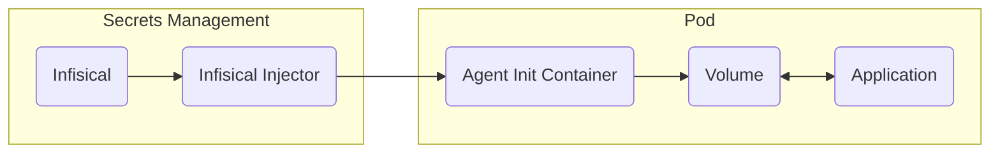

## Overview

The Infisical Kubernetes Agent Injector allows you to inject secrets directly into your Kubernetes pods. The Injector will create a [Infisical Agent](/integrations/platforms/infisical-agent) container within your pod that syncs secrets from Infisical into a shared volume mount within your pod.


The Infisical Agent Injector will patch and modify your pod's deployment to contain an [Infisical Agent](/integrations/platforms/infisical-agent) container which renders your Infisical secrets into a shared volume mount within your pod.

The Infisical Agent Injector is built on [Kubernetes Mutating Admission Webhooks](https://kubernetes.io/docs/reference/access-authn-authz/admission-controllers), and will watch for `CREATE` and `UPDATE` events on pods in your cluster.
The injector is namespace-agnostic, and will watch for pods in any namespace, but will only patch pods that have the `org.infisical.com/inject` annotation set to `true`.




## Install the Infisical Agent Injector

To install the Infisical Agent Injector, you will need to install our helm charts using [Helm](https://helm.sh/).

```bash
helm repo add infisical-helm-charts 'https://dl.cloudsmith.io/public/infisical/helm-charts/helm/charts/'
helm repo update
helm install --generate-name infisical-helm-charts/infisical-agent-injector
```

After installing the helm chart you can verify that the injector is running and working as intended by checking the logs of the injector pod.
```bash
$ kubectl logs deployment/infisical-agent-injector 
2025/05/19 14:20:05 Starting infisical-agent-injector...
2025/05/19 14:20:05 Generating self-signed certificate...
2025/05/19 14:20:06 Creating directory: /tmp/tls
2025/05/19 14:20:06 Writing cert to: /tmp/tls/tls.crt
2025/05/19 14:20:06 Writing key to: /tmp/tls/tls.key
2025/05/19 14:20:06 Starting HTTPS server on port 8585...
2025/05/19 14:20:06 Attempting to update webhook config (attempt 1)...
2025/05/19 14:20:06 Successfully updated webhook configuration with CA bundle
```

## Windows support

By default the agent injector is built for Linux-based pods, but supports injecting into Windows-based pods.

**To inject into Windows-based pods, no extra configuration is needed.** The agent injector will automatically detect and handle injections into Windows-based pods.

However, if you are trying to run the agent injector itself on a Windows-based pod, you'll need to configure your helm values.yaml file to point to a Windows-based image.


The Agent Injector will only run on and inject into Windows-based pods that are running on the supported Windows versions:
- **Windows Server 2022**
- **Windows Server 2019**

We're looking to add support for other Windows versions in the future. If you're using a different Windows version, please let us know by opening [an issue](https://github.com/Infisical/infisical-agent-injector/issues/new), and we'll look into adding support for your desired version as soon as possible.


You will need to set the `nodeSelector.kubernetes.io/os` label to `windows` and set the image tag to a Windows-based image. Below are two examples for Windows Server 2019 and Windows Server 2022.

<AccordionGroup>
  <Accordion title="Run Agent Injector on Windows Server 2019">

    Create your `values.yaml` file and add the following:

    ```yaml values.yaml
    image:
      repository: infisical/infisical-agent-injector
      tag: "v0.1.4-windows-server-2019"

    nodeSelector:
      kubernetes.io/os: windows
    ```

    Install the agent injector using the values.yaml file you created above.

    ```bash
    helm install --generate-name infisical-helm-charts/infisical-agent-injector -f values.yaml
    ```
  </Accordion>

  <Accordion title="Run Agent Injector on Windows Server 2022">

    Create your `values.yaml` file and add the following:

    ```yaml values.yaml
    image:
      repository: infisical/infisical-agent-injector
      tag: "v0.1.4-windows-server-2022"

    nodeSelector:
      kubernetes.io/os: windows
    ```

    Install the agent injector using the values.yaml file you created above.

    ```bash
    helm install --generate-name infisical-helm-charts/infisical-agent-injector -f values.yaml
    ```
  </Accordion>  
</AccordionGroup>


<Tip>
  Note that Windows support is only supported in version `v0.1.4` and above. If you are using an older version, you will need to upgrade to `v0.1.4` or above to use Windows support.
</Tip>

## Supported annotations

The Infisical Agent Injector supports the following annotations:

<AccordionGroup>
  <Accordion title="org.infisical.com/inject">
    The inject annotation is used to enable the injector on a pod. Set the value to `true` and the pod will be patched with an Infisical Agent container on update or create.
  </Accordion>
  <Accordion title="org.infisical.com/inject-mode">
    The inject mode annotation is used to specify the mode to use to inject the secrets into the pod.

    - `init`: The init method will create an init container for the pod that will render the secrets into a shared volume mount within the pod. The agent init container will run before any other containers in the pod runs, including other init containers.
    - `sidecar`: The sidecar method will create a sidecar container for the pod that will render the secrets into a shared volume mount within the pod. The agent sidecar container will run alongside the main container in the pod. This means that the secrets rendered will always be in sync with your Infisical secrets.
    - `sidecar-init`: The sidecar-init method will create the init container and the sidecar container from the other two methods. The init container will run before any other container and fetch the secrets from the start and the sidecar container will keep the secrets in sync throughout the lifecycle of the deployment.
  </Accordion>
  <Accordion title="org.infisical.com/agent-config-map">
    The agent config map annotation is used to specify the name of the config map that contains the configuration for the injector. The config map must be in the same namespace as the pod.
  </Accordion>

  <Accordion title="org.infisical.com/agent-cache-enabled">
    Whether to enable client-side caching of dynamic secret leases. Defaults to `false`. If you set this to `true`, the agent will persist any dynamic secret leases across restarts of the agent. This is especially useful when using the `sidecar-init` inject mode, to pass the dynamic secret leases created in the init container to the sidecar container.
    This will ensure that no new leases are created except those initially created in the init container. The sidecar container will register the leases created in the init container and start managing them from that point onwards.
  </Accordion>

  <Accordion title="org.infisical.com/agent-image">
    Specify a custom agent image to use for the agent sidecar / init container(s). Example: `infisical/cli:0.43.32`.
    If not specified, the most recent stable version of the Infisical Agent will be used.
  </Accordion>

  <Accordion title="org.infisical.com/agent-revoke-on-shutdown">
    Whether to revoke all managed dynamic secret leases and machine identity access tokens on shutdown. Defaults to `false`.
    
    If you set this to `true`, all managed dynamic secret leases and machine identity access tokens will be revoked when a `SIGTERM` signal is sent to the agents container _(such as when a pod is terminated or when the pod is restarted)_.
    
    **Note:** In disaster events such as cluster power outages, a `SIGTERM` signal won't be sent to the agents container, and the credentials will not be revoked.
  </Accordion>

  <Accordion title="org.infisical.com/agent-client-max-retries">
    How many times to retry failed API requests such as authentication, secret retrieval, etc. Defaults to `3` retries. Refer to the [Retrying mechanism](/integrations/platforms/infisical-agent#retrying-mechanism) documentation for more information on how to configure the retry strategy.
  </Accordion>

  <Accordion title="org.infisical.com/agent-client-max-delay">
    The maximum delay between retries. Defaults to `5s` (5 seconds). Refer to the [Retrying mechanism](/integrations/platforms/infisical-agent#retrying-mechanism) documentation for more information on how to configure the retry strategy.
  </Accordion>

  <Accordion title="org.infisical.com/agent-client-base-delay">
    The base delay between retries. Defaults to `200ms` (200 milliseconds). Refer to the [Retrying mechanism](/integrations/platforms/infisical-agent#retrying-mechanism) documentation for more information on how to configure the retry strategy.
  </Accordion>

  <Accordion title="org.infisical.com/agent-limits-cpu">
    The maximum CPU limit for the agent containers.
    
    Linux Pods: Defaults to `500m` (500 milliCPUs).
    Windows Pods: Defaults to `500m` (500 milliCPUs).
  </Accordion>

  <Accordion title="org.infisical.com/agent-requests-cpu">
    The minimum CPU request for the agent containers.
    
    Linux Pods: Defaults to `100m` (100 milliCPUs).
    Windows Pods: Defaults to `100m` (100 milliCPUs).
  </Accordion>

  <Accordion title="org.infisical.com/agent-limits-memory">
    The maximum memory limit for the agent containers.

    Linux Pods: Defaults to `128Mi` (128 megabytes).
    Windows Pods: Defaults to `512Mi` (512 megabytes).
  </Accordion>

  <Accordion title="org.infisical.com/agent-requests-memory">
    The minimum memory request for the agent containers.
    
    Linux Pods: Defaults to `64Mi` (64 megabytes).
    Windows Pods: Defaults to `256Mi` (256 megabytes).
  </Accordion>

  <Accordion title="org.infisical.com/agent-limits-ephemeral">
    The maximum ephemeral storage limit for the agent containers. Doesn't have an explicit default value. The default value will conform to the default ephemeral storage limit for the pod.
  </Accordion>

  <Accordion title="org.infisical.com/agent-requests-ephemeral">
    The minimum ephemeral storage request for the agent containers. Doesn't have an explicit default value. The default value will conform to the default ephemeral storage request for the pod.
  </Accordion>

</AccordionGroup>

## ConfigMap Configuration

### Supported Fields

When you are configuring a pod to use the injector, you must create a config map in the same namespace as the pod you want to inject secrets into.
The entire config needs to be of string format and needs to be assigned to the `config.yaml` key in the config map. You can find a full example of the config at the end of this section.

<AccordionGroup>
<Accordion title="infisical.address">
  The address of your Infisical instance. This field is optional and will default to `https://app.infisical.com` if not provided.
</Accordion>

<Accordion title="infisical.revoke-credentials-on-shutdown">
  Whether to revoke all managed dynamic secret leases and machine identity access tokens on shutdown. Default: `"false"`.

  If this is set to `true`, all managed dynamic secret leases and machine identity access tokens will be revoked when a `SIGTERM` signal is sent to the agents container _(such as when a pod is terminated or when the pod is restarted)_.
  
  **Note:** In disaster events such as cluster power outages, a `SIGTERM` signal won't be sent to the agents container, and the credentials will not be revoked.

  <Note>
    This is currently unsupported on Windows-based pods, and will only work when injecting into Linux-based pods.
    
    It's recommended to use the annotation `org.infisical.com/agent-revoke-on-shutdown: "true"` instead of configuring the revoke on shutdown on the config map. Refer to the [Supported annotations](/integrations/platforms/kubernetes-injector#supported-annotations) documentation for more information on how to configure the revoke on shutdown through annotations.
  </Note>
</Accordion>

<Accordion title="infisical.auth.type">
  The authentication type to use to connect to Infisical. Currently only the `kubernetes` authentication type is supported.
  You can refer to our [Kubernetes Auth](/documentation/platform/identities/kubernetes-auth) documentation for more information on how to create a machine identity for Kubernetes Auth.
  Please note that the pod's default service account will be used to authenticate with Infisical.
</Accordion>


<Accordion title="infisical.auth.config.identity-id">
  The ID of the machine identity to use for Kubernetes or LDAP authentication. This field is required if the `infisical.auth.type` is set to `kubernetes`.
</Accordion>

<Accordion title="infisical.auth.config.username">
  The LDAP username to use for LDAP authentication.
  This field is required if the `infisical.auth.type` is set to `ldap-auth`.
</Accordion>

<Accordion title="infisical.auth.config.password">
  The LDAP password to use for LDAP authentication.
  This field is required if the `infisical.auth.type` is set to `ldap-auth`.
</Accordion>

<Accordion title="infisical.retry-strategy.max-retries">
  How many times to retry failed API requests such as authentication, secret retrieval, etc. Defaults to `3` retries. Refer to the [Retrying mechanism](/integrations/platforms/infisical-agent#retrying-mechanism) documentation for more information on how to configure the retry strategy.

  <Note>
    You can also configure the max retries through annotations. Refer to the [Supported annotations](/integrations/platforms/kubernetes-injector#supported-annotations) documentation for more information on how to configure the max retries through annotations.
  </Note>
</Accordion>

<Accordion title="infisical.retry-strategy.max-delay">
  The maximum delay between retries. Defaults to `5s` (5 seconds). Refer to the [Retrying mechanism](/integrations/platforms/infisical-agent#retrying-mechanism) documentation for more information on how to configure the retry strategy.

  <Note>
    You can also configure the max delay through annotations. Refer to the [Supported annotations](/integrations/platforms/kubernetes-injector#supported-annotations) documentation for more information on how to configure the max delay through annotations.
  </Note>
</Accordion>

<Accordion title="infisical.retry-strategy.base-delay">
  The base delay between retries. Defaults to `200ms` (200 milliseconds). Refer to the [Retrying mechanism](/integrations/platforms/infisical-agent#retrying-mechanism) documentation for more information on how to configure the retry strategy.

  <Note>
    You can also configure the base delay through annotations. Refer to the [Supported annotations](/integrations/platforms/kubernetes-injector#supported-annotations) documentation for more information on how to configure the base delay through annotations.
  </Note>
</Accordion>

<Accordion title="cache.persistent.type">
  The type of persistent caching to use. Currently only `kubernetes` is available, and will only work within Kubernetes environments.

  <Note>
    It is recommended to use the annotation `org.infisical.com/agent-cache-enabled: "true"` instead of configuring the cache on the config map. Refer to the [Supported annotations](/integrations/platforms/kubernetes-injector#supported-annotations) documentation for more information on how to configure the cache through annotations.
  </Note>
</Accordion>

<Accordion title="cache.persistent.service-account-token-path">
  The path to the Kubernetes service account token to use for encrypting the persistent cache. Required when using `kubernetes` cache type. Defaults to `/var/run/secrets/kubernetes.io/serviceaccount/token`.

  <Note>
    It is recommended to use the annotation `org.infisical.com/agent-cache-enabled: "true"` instead of configuring the cache on the config map. Refer to the [Supported annotations](/integrations/platforms/kubernetes-injector#supported-annotations) documentation for more information on how to configure the cache through annotations.
  </Note>
</Accordion>

<Accordion title="templates[]">
The templates hold an array of templates that will be rendered and injected into the pod.
</Accordion>

<Accordion title="templates[].destination-path">
  The path to inject the secrets into within the pod.
  If not specified, this will default to `/shared/infisical-secrets`. If you have multiple templates and don't provide a destination path, the destination paths will default to `/shared/infisical-secrets-1`, `/shared/infisical-secrets-2`, etc.
</Accordion>

<Accordion title="templates[].template-content">
  The content of the template to render.
  This will be rendered as a [Go Template](https://pkg.go.dev/text/template) and will have access to the following variables.
  It follows the templating format and supports the same functions as the [Infisical Agent](/integrations/platforms/infisical-agent#quick-start-infisical-agent)
</Accordion>
</AccordionGroup>


### Authentication
The Infisical Agent Injector supports Machine Identity [Kubernetes Auth](/documentation/platform/identities/kubernetes-auth) and [LDAP Auth](/documentation/platform/identities/ldap-auth) authentication.


<AccordionGroup>
  <Accordion title="Kubernetes Auth">

    To configure Kubernetes Auth, you need to set the `auth.type` field to `kubernetes` and set the `auth.config.identity-id` to the ID of the machine identity you wish to use for authentication.
    ```yaml
    auth:
      type: "kubernetes"
      config:
        identity-id: "<your-infisical-machine-identity-id>"
    ```

    ### Example ConfigMap
    ```yaml config-map.yaml
    apiVersion: v1
    kind: ConfigMap
    metadata:
      name: demo-config-map
    data:
      config.yaml: |
        infisical:
          address: "https://app.infisical.com"
          auth:
            type: "kubernetes"
            config:
              identity-id: "<your-infisical-machine-identity-id>"
        templates:
          - destination-path: "/path/to/save/secrets/file.txt"
            template-content: |
              {{- with secret "<your-project-id>" "dev" "/" }}
              {{- range . }}
              {{ .Key }}={{ .Value }}
              {{- end }}
              {{- end }}
    ```

    ```bash
    kubectl apply -f config-map.yaml
    ```

  </Accordion>
  <Accordion title="LDAP Auth">
    To configure LDAP Auth, you need to set the `auth.type` field to `ldap-auth` and set the `auth.config.identity-id` to the ID of the machine identity you wish to use for authentication. Configure the `auth.config.username` and `auth.config.password` to the username and password of the LDAP user to authenticate with.

    ```yaml
    auth:
      type: "ldap-auth"
      config:
        identity-id: "<your-infisical-machine-identity-id>"
        username: "<your-ldap-username>"
        password: "<your-ldap-password>"
    ```

    ### Example ConfigMap
    ```yaml config-map.yaml
    apiVersion: v1
    kind: ConfigMap
    metadata:
      name: demo-config-map
    data:
      config.yaml: |
        infisical:
          address: "https://app.infisical.com"
          auth:
            type: "ldap-auth"
            config:
              identity-id: "<your-infisical-machine-identity-id>"
              username: "<your-ldap-username>"
              password: "<your-ldap-password>"
        templates:
          - destination-path: "/path/to/save/secrets/file.txt"
            template-content: |
              {{- with secret "<your-project-id>" "dev" "/" }}
              {{- range . }}
              {{ .Key }}={{ .Value }}
              {{- end }}
              {{- end }}
    ```

    ```bash
    kubectl apply -f config-map.yaml
    ```

  </Accordion>
</AccordionGroup>

To use the config map in your pod, you will need to add the `org.infisical.com/agent-config-map` annotation to your pod's deployment. The value of the annotation is the name of the config map you created above. The config map must be in the same namespace as the pod you're injecting into.
```yaml
apiVersion: v1
kind: Pod
metadata:
  name: demo
  labels:
    app: demo
  annotations:
    org.infisical.com/inject: "true" # Set to true for the injector to patch the pod on create/update events
    org.infisical.com/inject-mode: "init" # The mode to use to inject the secrets into the pod. init|sidecar
    org.infisical.com/agent-config-map: "name-of-config-map" # The name of the config map that you created above, which contains all the settings for injecting the secrets into the pod
spec:
  # ...
```


## Quick Start
In this section we'll walk through a full example of how to inject secrets into a pod using the Infisical Agent Injector.
In this example we'll create a basic nginx deployment and print a Infisical secret called `API_KEY` to the container logs.

### Create secrets in Infisical
First you'll need to create the secret in Infisical.

- `API_KEY`: The API key to use for the nginx deployment.

Once you've created the secret, save your project ID, environment slug, and secret path, as these will be used in the next step.

### Configuration
To use the injector you must create a config map in the same namespace as the pod you want to inject secrets into. In this example we'll create a config map in the `test-namespace` namespace.

The agent injector will authenticate with Infisical using a [Kubernetes Auth](/documentation/platform/identities/kubernetes-auth) machine identity. Please follow the [instructions](/documentation/platform/identities/kubernetes-auth) to create a machine identity configured for Kubernetes Auth.
The agent injector will use the service account token of the pod to authenticate with Infisical.

The `template-content` will be rendered as a [Go Template](https://pkg.go.dev/text/template) and will have access to the following variables. It follows the templating format and supports the same functions as the [Infisical Agent](/integrations/platforms/infisical-agent#quick-start-infisical-agent)
The `destination-path` refers to the path within the pod that the secrets will be injected into. In this case we're injecting the secrets into a file called `/infisical/secrets`.


Replace the `<your-project-id>`, `<your-environment-slug>`, with your project ID and the environment slug of where you created your secrets in Infisical. Replace `<your-infisical-machine-identity-id>` with the ID of your machine identity configured for Kubernetes Auth.
```yaml config-map.yaml
apiVersion: v1
kind: ConfigMap
metadata:
  name: nginx-infisical-config-map
  namespace: test-namespace
data:
  config.yaml: |
    infisical:
      address: "https://app.infisical.com"
      auth:
        type: "kubernetes"
        config:
          identity-id: "<your-infisical-machine-identity-id>"
    templates:
      - destination-path: "/infisical/secrets"
        template-content: |
          {{- with secret "<your-project-id>" "<your-environment-slug>" "/" }}
          {{- range . }}
          {{ .Key }}={{ .Value }}
          {{- end }}
          {{- end }}
```

Now apply the config map:
```bash
kubectl apply -f config-map.yaml
```

### Injecting secrets into your pod

To inject secrets into your pod, you will need to add the `org.infisical.com/inject: "true"` annotation to your pod's deployment.

The `org.infisical.com/agent-config-map` annotation will point to the config map we created in the previous step. It's important that the config map is in the same namespace as the pod.

We are creating a nginx deployment with a PVC to store the database data.

```yaml nginx.yaml
---
apiVersion: v1
kind: Pod
metadata:
  name: nginx-pod
  namespace: test-namespace
  labels:
    app: nginx
  annotations:
    org.infisical.com/inject: "true"
    org.infisical.com/inject-mode: "init"
    org.infisical.com/agent-config-map: "nginx-infisical-config-map"
spec:
  containers:
    - name: simple-app-demo
      image: nginx:alpine
      command: ["/bin/sh", "-c"]
      args:
        - |
          export $(cat /infisical/secrets | xargs)
          echo "API_KEY is set to: $API_KEY"
          nginx -g "daemon off;"
```

### Applying the deployment

To apply the deployment, you can use the following command:

```bash
kubectl apply -f nginx.yaml
```
It may take a few minutes for the pod to be ready and for the Infisical secrets to be injected. You can check the status of the pod by running:

```bash
kubectl get pods -n test-namespace
```

### Verifying the secrets are injected

To verify the secrets are injected, you can check the pod's logs:

```bash
$ kubectl exec -it pod/nginx-pod -n test-namespace -- cat /infisical/secrets

Defaulted container "simple-app-demo" out of: simple-app-demo, infisical-agent-init (init)

API_KEY=sk_api_... # The secret you created in Infisical
```

Additionally you can now check that the `API_KEY` secret is being logged to the nginx container logs:
```bash
$ kubectl logs pod/nginx-pod -n test-namespace                              
Defaulted container "simple-app-demo" out of: simple-app-demo, infisical-agent-init (init)
API_KEY is set to: sk_api_... # The secret you created in Infisical
```


## Troubleshooting


<Accordion title="The pod is stuck in `Init` state">
  If the pod is stuck in `Init` state, it means the Agent init container is failing to start or is stuck in a restart loop.
  This could be due to a number of reasons, such as the machine identity not having the correct permissions, or trying to fetch secrets from a non-existent project/environment.
  
  You can check the logs of the infisical init container by running:
  ```bash
  # For deployments
  kubectl logs deployment/your-deployment-name -c infisical-agent-init -n "<namespace>"

  # For pods
  kubectl logs pod/your-pod-name -c infisical-agent-init -n "<namespace>"
  ```

  You can also check the logs of the pod by running:
  ```bash
  kubectl logs deployment/postgres-deployment -n test-namespace
  ```

  When checking the logs of the agent init container, you may see something like the following:
  ```bash
  Starting infisical agent...
  11:10AM INF starting Infisical agent...
  11:10AM INF Infisical instance address set to https://daniel1.tunn.dev
  11:10AM INF template engine started for template 1...
  11:10AM INF attempting to authenticate...
  11:10AM INF new access token saved to file at path '/home/infisical/config/identity-access-token'
  11:10AM ERR unable to process template because template: literalTemplate:1:9: executing "literalTemplate" at <secret "3c0d3ff6-165c-4dc9-b52c-ff3ffaedfce311111" "dev" "/">: error calling secret: CallGetRawSecretsV3: Unsuccessful response [GET https://daniel1.tunn.dev/api/v3/secrets/raw?environment=dev&expandSecretReferences=true&include_imports=true&secretPath=%2F&workspaceId=3c0d3ff6-165c-4dc9-b52c-ff3ffaedfce311111] [status-code=404] [response={"reqId":"req-ljqNq567jchFrK","statusCode":404,"message":"Project with ID '3c0d3ff6-165c-4dc9-b52c-ff3ffaedfce311111' not found during bot lookup. Are you sure you are using the correct project ID?","error":"NotFound"}]
  + echo 'Agent failed with exit code 1'
  + exit 1
  Agent failed with exit code 1
  ```

  In the above error, the project ID was invalid in the config map.
</Accordion>