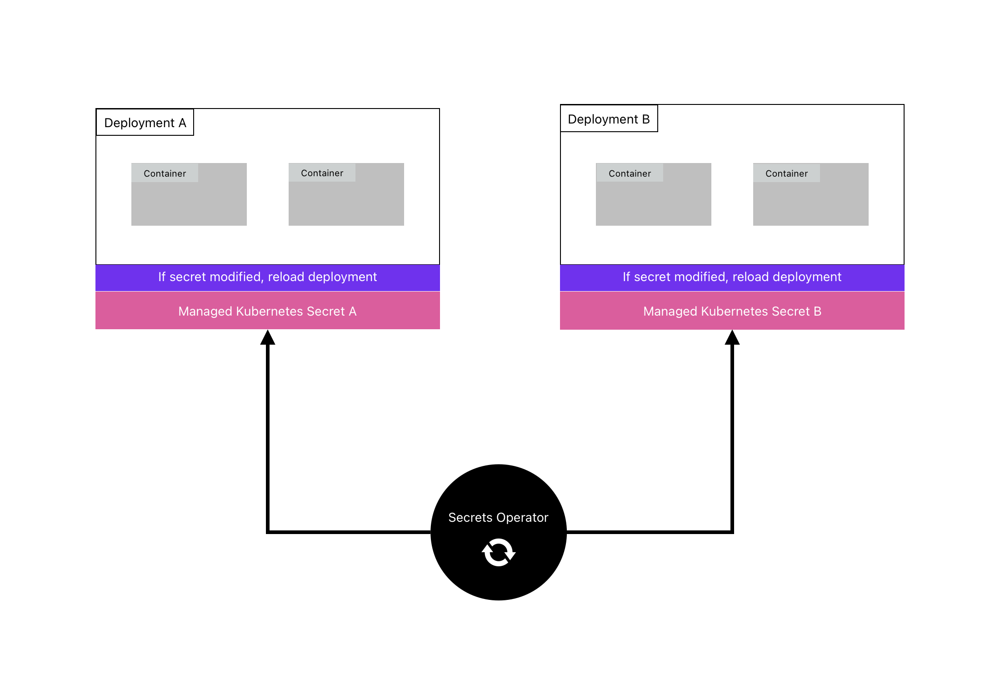

The Infisical Secrets Operator is a Kubernetes controller that retrieves secrets from Infisical and stores them in a designated cluster.
It uses an `InfisicalSecret` resource to specify authentication and storage methods.
The operator continuously updates secrets and can also reload dependent deployments automatically.

<Note>
  If you are already using the External Secrets operator, you can view the integration documentation for it [here](https://external-secrets.io/latest/provider/infisical/).
</Note>

## Install Operator

The operator can be install via [Helm](https://helm.sh) or [kubectl](https://github.com/kubernetes/kubectl)

<Tabs>
	 <Tab title="Helm (recommended)">
		**Install the latest Infisical Helm repository**
    ```bash
    helm repo add infisical-helm-charts 'https://dl.cloudsmith.io/public/infisical/helm-charts/helm/charts/' 
      
    helm repo update
    ```

    **Install the Helm chart**

    To select a specific version, view the  application versions [here](https://hub.docker.com/r/infisical/kubernetes-operator/tags) and chart versions [here](https://cloudsmith.io/~infisical/repos/helm-charts/packages/detail/helm/secrets-operator/#versions)

    ```bash
    helm install --generate-name infisical-helm-charts/secrets-operator 
    ```

    ```bash
    # Example installing app version v0.2.0 and chart version 0.1.4
    helm install --generate-name infisical-helm-charts/secrets-operator --version=0.1.4 --set controllerManager.manager.image.tag=v0.2.0
    ```

   </Tab>
	 <Tab title="Kubectl">
   For production deployments, it is highly recommended to set the version of the Kubernetes operator manually instead of pointing to the latest version.
   Doing so will help you avoid accidental updates to the newest release which may introduce unintended breaking changes. View all application versions [here](https://hub.docker.com/r/infisical/kubernetes-operator/tags).

The command below will install the most recent version of the Kubernetes operator.
However, to set the version manually, download the manifest and set the image tag version of `infisical/kubernetes-operator` according to your desired version.

Once you apply the manifest, the operator will be installed in `infisical-operator-system` namespace.

    ```
    kubectl apply -f https://raw.githubusercontent.com/Infisical/infisical/main/k8-operator/kubectl-install/install-secrets-operator.yaml
    	```

   </Tab>
</Tabs>

## Sync Infisical Secrets to your cluster

Once you have installed the operator to your cluster, you'll need to create a `InfisicalSecret` custom resource definition (CRD).

```yaml example-infisical-secret-crd.yaml

apiVersion: secrets.infisical.com/v1alpha1
kind: InfisicalSecret
metadata:
    name: infisicalsecret-sample
    labels:
        label-to-be-passed-to-managed-secret: sample-value
    annotations:
        example.com/annotation-to-be-passed-to-managed-secret: "sample-value"
spec:
    hostAPI: https://app.infisical.com/api
    resyncInterval: 10
    authentication:
        # Make sure to only have 1 authentication method defined, serviceToken/universalAuth.
        # If you have multiple authentication methods defined, it may cause issues.

        # (Deprecated) Service Token Auth
        serviceToken:
            serviceTokenSecretReference:
                secretName: service-token
                secretNamespace: default
            secretsScope:
                envSlug: <env-slug>
                secretsPath: <secrets-path>
                recursive: true

        # Universal Auth
        universalAuth:
            secretsScope:
                projectSlug: new-ob-em
                envSlug: dev # "dev", "staging", "prod", etc..
                secretsPath: "/" # Root is "/"
                recursive: true # Wether or not to use recursive mode (Fetches all secrets in an environment from a given secret path, and all folders inside the path) / defaults to false
            credentialsRef:
                secretName: universal-auth-credentials
                secretNamespace: default

        # Native Kubernetes Auth
        kubernetesAuth:
            identityId: <machine-identity-id>
            serviceAccountRef:
              name: <service-account-name>
              namespace: <service-account-namespace>

            # secretsScope is identical to the secrets scope in the universalAuth field in this sample.
            secretsScope:
                projectSlug: your-project-slug
                envSlug: prod
                secretsPath: "/path"
                recursive: true

        # AWS IAM Auth
        awsIamAuth:
            identityId: <your-machine-identity-id>

            # secretsScope is identical to the secrets scope in the universalAuth field in this sample.
            secretsScope:
                projectSlug: your-project-slug
                envSlug: prod
                secretsPath: "/path"
                recursive: true

        # Azure Auth
        azureAuth:
            identityId: <your-machine-identity-id>
            resource: https://management.azure.com/&client_id=CLIENT_ID # (Optional) This is the Azure resource that you want to access. For example, "https://management.azure.com/". If no value is provided, it will default to "https://management.azure.com/"

            # secretsScope is identical to the secrets scope in the universalAuth field in this sample.
            secretsScope:
                projectSlug: your-project-slug
                envSlug: prod
                secretsPath: "/path"
                recursive: true

        # GCP ID Token Auth
        gcpIdTokenAuth:
            identityId: <your-machine-identity-id>

            # secretsScope is identical to the secrets scope in the universalAuth field in this sample.
            secretsScope:
                projectSlug: your-project-slug
                envSlug: prod
                secretsPath: "/path"
                recursive: true

        # GCP IAM Auth
        gcpIamAuth:
            identityId: <your-machine-identity-id>

            # secretsScope is identical to the secrets scope in the universalAuth field in this sample.
            secretsScope:
                projectSlug: your-project-slug
                envSlug: prod
                secretsPath: "/path"
                recursive: true

    managedSecretReference:
        secretName: managed-secret
        secretNamespace: default
        creationPolicy: "Orphan" ## Owner | Orphan
        # secretType: kubernetes.io/dockerconfigjson


```

### InfisicalSecret CRD properties

<Accordion title="hostAPI">
  If you are fetching secrets from a self hosted instance of Infisical set the value of `hostAPI` to 
  ` https://your-self-hosted-instace.com/api`

When `hostAPI` is not defined the operator fetches secrets from Infisical Cloud.

  <Accordion title="Advanced use case">
    If you have installed your Infisical instance within the same cluster as the Infisical operator, you can optionally access the Infisical backend's service directly without having to route through the public internet. 
    To achieve this, use the following address for the hostAPI field:
    
    ``` bash
    http://<backend-svc-name>.<namespace>.svc.cluster.local:4000/api
    ```

    Make sure to replace `<backend-svc-name>` and `<namespace>` with the appropriate values for your backend service and namespace.

  </Accordion>
</Accordion>

<Accordion title="resyncInterval">
  This property defines the time in seconds between each secret re-sync from
  Infisical. Shorter time between re-syncs will require higher rate limits only
  available on paid plans. Default re-sync interval is every 1 minute.
</Accordion>

<Accordion title="authentication">
  This block defines the method that will be used to authenticate with Infisical
  so that secrets can be fetched
</Accordion>

<Accordion title="authentication.universalAuth">
  The universal machine identity authentication method is used to authenticate with Infisical. The client ID and client secret needs to be stored in a Kubernetes secret. This block defines the reference to the name and namespace of secret that stores these credentials.

  <Steps>
    <Step title="Create a machine identity">
      You need to create a machine identity, and give it access to the project(s) you want to interact with. You can [read more about machine identities here](/documentation/platform/identities/universal-auth).
    </Step>
    <Step title="Create Kubernetes secret containing machine identity credentials">
      Once you have created your machine identity and added it to your project(s), you will need to create a Kubernetes secret containing the identity credentials.
      To quickly create a Kubernetes secret containing the identity credentials, you can run the command below.
      
      Make sure you replace `<your-identity-client-id>` with the identity client ID and `<your-identity-client-secret>` with the identity client secret.

      ``` bash
        kubectl create secret generic universal-auth-credentials --from-literal=clientId="<your-identity-client-id>" --from-literal=clientSecret="<your-identity-client-secret>"
      ```
    </Step>

    <Step title="Add reference for the Kubernetes secret containing the identity credentials">
      Once the secret is created, add the `secretName` and `secretNamespace` of the secret that was just created under `authentication.universalAuth.credentialsRef` field in the InfisicalSecret resource.
    </Step>

  </Steps>


<Info>
  Make sure to also populate the `secretsScope` field with the project slug
  _`projectSlug`_, environment slug _`envSlug`_, and secrets path
  _`secretsPath`_ that you want to fetch secrets from. Please see the example
  below.
</Info>

## Example

```yaml
apiVersion: secrets.infisical.com/v1alpha1
kind: InfisicalSecret
metadata:
  name: infisicalsecret-sample-crd
spec:
  authentication:
      universalAuth:
          secretsScope:
              projectSlug: <project-slug> # <-- project slug
              envSlug: <env-slug> # "dev", "staging", "prod", etc..
              secretsPath: "<secrets-path>" # Root is "/"
          credentialsRef:
              secretName: universal-auth-credentials # <-- name of the Kubernetes secret that stores our machine identity credentials
              secretNamespace: default # <-- namespace of the Kubernetes secret that stores our machine identity credentials
  ...
```

</Accordion>

<Accordion title="authentication.kubernetesAuth">
  The Kubernetes machine identity authentication method is used to authenticate with Infisical. The identity ID is stored in a field in the InfisicalSecret resource. This authentication method can only be used within a Kubernetes environment.

  <Steps>
    <Step title="Obtaining the token reviewer JWT for Infisical">
        1.1. Start by creating a service account in your Kubernetes cluster that will be used by Infisical to authenticate with the Kubernetes API Server.

        ```yaml infisical-service-account.yaml
        apiVersion: v1
        kind: ServiceAccount
        metadata:
          name: infisical-auth
          namespace: default

        ```

        ```
        kubectl apply -f infisical-service-account.yaml
        ```

        1.2. Bind the service account to the `system:auth-delegator` cluster role. As described [here](https://kubernetes.io/docs/reference/access-authn-authz/rbac/#other-component-roles), this role allows delegated authentication and authorization checks, specifically for Infisical to access the [TokenReview API](https://kubernetes.io/docs/reference/kubernetes-api/authentication-resources/token-review-v1/). You can apply the following configuration file:

        ```yaml cluster-role-binding.yaml
        apiVersion: rbac.authorization.k8s.io/v1
        kind: ClusterRoleBinding
        metadata:
          name: role-tokenreview-binding
          namespace: default
        roleRef:
          apiGroup: rbac.authorization.k8s.io
          kind: ClusterRole
          name: system:auth-delegator
        subjects:
          - kind: ServiceAccount
            name: infisical-auth
            namespace: default
        ```

        ```
        kubectl apply -f cluster-role-binding.yaml
        ```

        1.3. Next, create a long-lived service account JWT token (i.e. the token reviewer JWT token) for the service account using this configuration file for a new `Secret` resource:

        ```yaml service-account-token.yaml
        apiVersion: v1
        kind: Secret
        type: kubernetes.io/service-account-token
        metadata:
          name: infisical-auth-token
          annotations:
            kubernetes.io/service-account.name: "infisical-auth"
        ```


        ```
        kubectl apply -f service-account-token.yaml
        ```

        1.4. Link the secret in step 1.3 to the service account in step 1.1:

        ```bash
        kubectl patch serviceaccount infisical-auth -p '{"secrets": [{"name": "infisical-auth-token"}]}' -n default
        ```

        1.5. Finally, retrieve the token reviewer JWT token from the secret.

        ```bash
        kubectl get secret infisical-auth-token -n default -o=jsonpath='{.data.token}' | base64 --decode
        ```

        Keep this JWT token handy as you will need it for the **Token Reviewer JWT** field when configuring the Kubernetes Auth authentication method for the identity in step 2.

    </Step>

    <Step title="Creating an identity">
      To create an identity, head to your Organization Settings > Access Control > Machine Identities and press **Create identity**.

      

      When creating an identity, you specify an organization level [role](/documentation/platform/role-based-access-controls) for it to assume; you can configure roles in Organization Settings > Access Control > Organization Roles.

      

      Now input a few details for your new identity. Here's some guidance for each field:

      - Name (required): A friendly name for the identity.
      - Role (required): A role from the **Organization Roles** tab for the identity to assume. The organization role assigned will determine what organization level resources this identity can have access to.

      Once you've created an identity, you'll be prompted to configure the authentication method for it. Here, select **Kubernetes Auth**.

      <Info>
        To learn more about each field of the Kubernetes native authentication method, see step 2 of [guide](/documentation/platform/identities/kubernetes-auth#guide).
      </Info>

      


    </Step>
    <Step title="Adding an identity to a project">
      To allow the operator to use the given identity to access secrets, you will need to add the identity to project(s) that you would like  to grant it access to.

      To do this, head over to the project you want to add the identity to and go to Project Settings > Access Control > Machine Identities and press **Add identity**.

      Next, select the identity you want to add to the project and the project level role you want to allow it to assume. The project role assigned will determine what project level resources this identity can have access to.

      

      

    </Step>
    <Step title="Add your identity ID & service account to your InfisicalSecret resource">
      Once you have created your machine identity and added it to your project(s), you will need to add the identity ID to your InfisicalSecret resource. 
      In the `authentication.kubernetesAuth.identityId` field, add the identity ID of the machine identity you created. 
      See the example below for more details.
    </Step>
    <Step title="Add your Kubernetes service account token to the InfisicalSecret resource">
      Add the service account details from the previous steps under `authentication.kubernetesAuth.serviceAccountRef`. 
      Here you will need to enter the name and namespace of the service account. 
      The example below shows a complete InfisicalSecret resource with all required fields defined.
    </Step> 

  </Steps>

<Info>
  Make sure to also populate the `secretsScope` field with the project slug
  _`projectSlug`_, environment slug _`envSlug`_, and secrets path
  _`secretsPath`_ that you want to fetch secrets from. Please see the example
  below.
</Info>

## Example

```yaml example-kubernetes-auth.yaml
apiVersion: secrets.infisical.com/v1alpha1
kind: InfisicalSecret
metadata:
  name: infisicalsecret-sample-crd
spec:
  authentication:
      kubernetesAuth:
          identityId: <machine-identity-id>
          serviceAccountRef:
            name: <service-account-name>
            namespace: <service-account-namespace>

          # secretsScope is identical to the secrets scope in the universalAuth field in this sample.
          secretsScope:
              projectSlug: your-project-slug
              envSlug: prod
              secretsPath: "/path"
              recursive: true
  ...
```

</Accordion>

<Accordion title="authentication.awsIamAuth">
  The AWS IAM machine identity authentication method is used to authenticate with Infisical. The identity ID is stored in a field in the InfisicalSecret resource. This authentication method can only be used within an AWS environment like an EC2 or a Lambda function.

  <Steps>
    <Step title="Create a machine identity">
      You need to create a machine identity, and give it access to the project(s) you want to interact with. You can [read more about AWS machine identities here](/documentation/platform/identities/aws-auth).
    </Step>
    <Step title="Add your identity ID to your InfisicalSecret resource">
      Once you have created your machine identity and added it to your project(s), you will need to add the identity ID to your InfisicalSecret resource. In the `authentication.awsIamAuth.identityId` field, add the identity ID of the machine identity you created. See the example below for more details.
    </Step>

  </Steps>

<Info>
  Make sure to also populate the `secretsScope` field with the project slug
  _`projectSlug`_, environment slug _`envSlug`_, and secrets path
  _`secretsPath`_ that you want to fetch secrets from. Please see the example
  below.
</Info>

## Example

```yaml example-aws-iam-auth.yaml
apiVersion: secrets.infisical.com/v1alpha1
kind: InfisicalSecret
metadata:
  name: infisicalsecret-sample-crd
spec:
  authentication:
      awsIamAuth:
          identityId: <your-machine-identity-id>

          # secretsScope is identical to the secrets scope in the universalAuth field in this sample.
          secretsScope:
              projectSlug: your-project-slug
              envSlug: prod
              secretsPath: "/path"
              recursive: true
  ...
```

</Accordion>

<Accordion title="authentication.azureAuth">
  The Azure machine identity authentication method is used to authenticate with Infisical. The identity ID is stored in a field in the InfisicalSecret resource. This authentication method can only be used within an Azure environment.

  <Steps>
    <Step title="Create a machine identity">
      You need to create a machine identity, and give it access to the project(s) you want to interact with. You can [read more about Azure machine identities here](/documentation/platform/identities/azure-auth).
    </Step>
    <Step title="Add your identity ID to your InfisicalSecret resource">
      Once you have created your machine identity and added it to your project(s), you will need to add the identity ID to your InfisicalSecret resource. In the `authentication.azureAuth.identityId` field, add the identity ID of the machine identity you created. See the example below for more details.
    </Step>

  </Steps>

<Info>
  Make sure to also populate the `secretsScope` field with the project slug
  _`projectSlug`_, environment slug _`envSlug`_, and secrets path
  _`secretsPath`_ that you want to fetch secrets from. Please see the example
  below.
</Info>

## Example

```yaml example-azure-auth.yaml
apiVersion: secrets.infisical.com/v1alpha1
kind: InfisicalSecret
metadata:
  name: infisicalsecret-sample-crd
spec:
  authentication:
      azureAuth:
          identityId: <your-machine-identity-id>

          # secretsScope is identical to the secrets scope in the universalAuth field in this sample.
          secretsScope:
              projectSlug: your-project-slug
              envSlug: prod
              secretsPath: "/path"
              recursive: true
  ...
```

</Accordion>

<Accordion title="authentication.gcpIdTokenAuth">
  The GCP ID Token machine identity authentication method is used to authenticate with Infisical. The identity ID is stored in a field in the InfisicalSecret resource. This authentication method can only be used within GCP environments.

  <Steps>
    <Step title="Create a machine identity">
      You need to create a machine identity, and give it access to the project(s) you want to interact with. You can [read more about GCP machine identities here](/documentation/platform/identities/gcp-auth).
    </Step>
    <Step title="Add your identity ID to your InfisicalSecret resource">
      Once you have created your machine identity and added it to your project(s), you will need to add the identity ID to your InfisicalSecret resource. In the `authentication.gcpIdTokenAuth.identityId` field, add the identity ID of the machine identity you created. See the example below for more details.
    </Step>

  </Steps>

<Info>
  Make sure to also populate the `secretsScope` field with the project slug
  _`projectSlug`_, environment slug _`envSlug`_, and secrets path
  _`secretsPath`_ that you want to fetch secrets from. Please see the example
  below.
</Info>

## Example

```yaml example-gcp-id-token-auth.yaml
apiVersion: secrets.infisical.com/v1alpha1
kind: InfisicalSecret
metadata:
  name: infisicalsecret-sample-crd
spec:
  authentication:
      gcpIdTokenAuth:
          identityId: <your-machine-identity-id>

          # secretsScope is identical to the secrets scope in the universalAuth field in this sample.
          secretsScope:
              projectSlug: your-project-slug
              envSlug: prod
              secretsPath: "/path"
              recursive: true
  ...
```

</Accordion>


<Accordion title="authentication.gcpIamAuth">
  The GCP IAM machine identity authentication method is used to authenticate with Infisical. The identity ID is stored in a field in the InfisicalSecret resource. This authentication method can only be used both within and outside GCP environments.

  <Steps>
    <Step title="Create a machine identity">
      You need to create a machine identity, and give it access to the project(s) you want to interact with. You can [read more about GCP machine identities here](/documentation/platform/identities/gcp-auth).
    </Step>
    <Step title="Add your identity ID and service account token path to your InfisicalSecret resource">
      Once you have created your machine identity and added it to your project(s), you will need to add the identity ID to your InfisicalSecret resource. In the `authentication.gcpIamAuth.identityId` field, add the identity ID of the machine identity you created.
      You'll also need to add the service account key file path to your InfisicalSecret resource. In the `authentication.gcpIamAuth.serviceAccountKeyFilePath` field, add the path to your service account key file path. Please see the example below for more details.
    </Step>

  </Steps>

<Info>
  Make sure to also populate the `secretsScope` field with the project slug
  _`projectSlug`_, environment slug _`envSlug`_, and secrets path
  _`secretsPath`_ that you want to fetch secrets from. Please see the example
  below.
</Info>

## Example

```yaml example-gcp-id-token-auth.yaml
apiVersion: secrets.infisical.com/v1alpha1
kind: InfisicalSecret
metadata:
  name: infisicalsecret-sample-crd
spec:
  authentication:
      gcpIamAuth:
          identityId: <your-machine-identity-id>
          serviceAccountKeyFilePath: "/path/to-service-account-key-file-path.json"

          # secretsScope is identical to the secrets scope in the universalAuth field in this sample.
          secretsScope:
              projectSlug: your-project-slug
              envSlug: prod
              secretsPath: "/path"
              recursive: true
  ...
```

</Accordion>

<Accordion title="authentication.serviceToken">

The service token required to authenticate with Infisical needs to be stored in a Kubernetes secret. This block defines the reference to the name and namespace of secret that stores this service token.
Follow the instructions below to create and store the service token in a Kubernetes secrets and reference it in your CRD.

#### 1. Generate service token

You can generate a [service token](../../documentation/platform/token) for an Infisical project by heading over to the Infisical dashboard then to Project Settings.

#### 2. Create Kubernetes secret containing service token

Once you have generated the service token, you will need to create a Kubernetes secret containing the service token you generated.
To quickly create a Kubernetes secret containing the generated service token, you can run the command below. Make sure you replace `<your-service-token-here>` with your service token.

```bash
kubectl create secret generic service-token --from-literal=infisicalToken="<your-service-token-here>"
```

#### 3. Add reference for the Kubernetes secret containing service token

Once the secret is created, add the name and namespace of the secret that was just created under `authentication.serviceToken.serviceTokenSecretReference` field in the InfisicalSecret resource.

{" "}

<Info>
  Make sure to also populate the `secretsScope` field with the, environment slug
  _`envSlug`_, and secrets path _`secretsPath`_ that you want to fetch secrets
  from. Please see the example below.
</Info>

## Example

```yaml
apiVersion: secrets.infisical.com/v1alpha1
kind: InfisicalSecret
metadata:
  name: infisicalsecret-sample-crd
spec:
  authentication:
    serviceToken:
      serviceTokenSecretReference:
        secretName: service-token # <-- name of the Kubernetes secret that stores our service token
        secretNamespace: option # <-- namespace of the Kubernetes secret that stores our service token
      secretsScope:
        envSlug: <env-slug> # "dev", "staging", "prod", etc..
        secretsPath: <secrets-path> # Root is "/"
  ...
```

</Accordion>

<Accordion title="managedSecretReference">
The `managedSecretReference` field is used to define the target location for storing secrets retrieved from an Infisical project. 
This field requires specifying both the name and namespace of the Kubernetes secret that will hold these secrets. 
The Infisical operator will automatically create the Kubernetes secret with the specified name/namespace and keep it continuously updated.

Note: The managed secret be should be created in the same namespace as the deployment that will use it.

</Accordion>
<Accordion title="managedSecretReference.secretName">
The name of the managed Kubernetes secret to be created
</Accordion>
<Accordion title="managedSecretReference.secretNamespace">
The namespace of the managed Kubernetes secret to be created. 
</Accordion>
<Accordion title="managedSecretReference.secretType">
Override the default Opaque type for managed secrets with this field. Useful for creating kubernetes.io/dockerconfigjson secrets.
</Accordion>
<Accordion title="managedSecretReference.creationPolicy">
Creation polices allow you to control whether or not owner references should be added to the managed Kubernetes secret that is generated by the Infisical operator. 
This is useful for tools such as ArgoCD, where every resource requires an owner reference; otherwise, it will be pruned automatically.

#### Available options

- `Orphan` (default)
- `Owner`

<Tip>
  When creation policy is set to `Owner`, the `InfisicalSecret` CRD must be in
  the same namespace as where the managed kubernetes secret.
</Tip>

</Accordion>

### Propagating labels & annotations

The operator will transfer all labels & annotations present on the `InfisicalSecret` CRD to the managed Kubernetes secret to be created.
Thus, if a specific label is required on the resulting secret, it can be applied as demonstrated in the following example:

<Accordion title="Example propagation">
```yaml
apiVersion: secrets.infisical.com/v1alpha1
kind: InfisicalSecret
metadata:
  name: infisicalsecret-sample
  labels:
    label-to-be-passed-to-managed-secret: sample-value
  annotations:
    example.com/annotation-to-be-passed-to-managed-secret: "sample-value"
spec:
  ..
  authentication:
    ...
  managedSecretReference:
    ...
```

This would result in the following managed secret to be created:

```yaml
apiVersion: v1
data: ...
kind: Secret
metadata:
  annotations:
    example.com/annotation-to-be-passed-to-managed-secret: sample-value
    secrets.infisical.com/version: W/"3f1-ZyOSsrCLGSkAhhCkY2USPu2ivRw"
  labels:
    label-to-be-passed-to-managed-secret: sample-value
  name: managed-token
  namespace: default
type: Opaque
```

</Accordion>

### Apply the Infisical CRD to your cluster

Once you have configured the Infisical CRD with the required fields, you can apply it to your cluster.
After applying, you should notice that the managed secret has been created in the desired namespace your specified.

```
kubectl apply -f example-infisical-secret-crd.yaml
```

### Verify managed secret creation

To verify that the operator has successfully created the managed secret, you can check the secrets in the namespace that was specified.

```bash
# Verify managed secret is created
kubectl get secrets -n <namespace of managed secret>
```

<Info>
  The Infisical secrets will be synced and stored into the managed secret every
  1 minutes.
</Info>

### Using managed secret in your deployment

Incorporating the managed secret created by the operator into your deployment can be achieved through several methods.
Here, we will highlight three of the most common ways to utilize it. Learn more about Kubernetes secrets [here](https://kubernetes.io/docs/concepts/configuration/secret/)

<Accordion title="envFrom">
  This will take all the secrets from your managed secret and expose them to your container

````yaml
  envFrom:
    - secretRef:
        name: managed-secret # managed secret name
  ```

  Example usage in a deployment
  ```yaml
  apiVersion: apps/v1
kind: Deployment
metadata:
  name: nginx-deployment
  labels:
    app: nginx
spec:
  replicas: 1
  selector:
    matchLabels:
      app: nginx
  template:
    metadata:
      labels:
        app: nginx
    spec:
      containers:
      - name: nginx
        image: nginx:1.14.2
        envFrom:
        - secretRef:
            name: managed-secret # <- name of managed secret
        ports:
        - containerPort: 80
````

</Accordion>

<Accordion title="env"> 
  This will allow you to select individual secrets by key name from your managed secret and expose them to your container 
  
  ```yaml
  env:
    - name: SECRET_NAME # The environment variable's name which is made available in the container
      valueFrom:
        secretKeyRef:
          name: managed-secret # managed secret name
          key: SOME_SECRET_KEY # The name of the key which  exists in the managed secret
  ```

Example usage in a deployment

```yaml
apiVersion: apps/v1
kind: Deployment
metadata:
name: nginx-deployment
labels:
app: nginx
spec:
replicas: 1
selector:
matchLabels:
app: nginx
template:
metadata:
labels:
app: nginx
spec:
containers: - name: nginx
image: nginx:1.14.2
env: - name: STRIPE_API_SECRET
valueFrom:
secretKeyRef:
name: managed-secret # <- name of managed secret
key: STRIPE_API_SECRET
ports: - containerPort: 80

```

</Accordion>

<Accordion title="volumes">
This will allow you to create a volume on your container which comprises of files holding the secrets in your managed kubernetes secret
```yaml
volumes:
  - name: secrets-volume-name # The name of the volume under which secrets will be stored
    secret:
      secretName: managed-secret # managed secret name
````

You can then mount this volume to the container's filesystem so that your deployment can access the files containing the managed secrets

```yaml
volumeMounts:
  - name: secrets-volume-name
    mountPath: /etc/secrets
    readOnly: true
```

Example usage in a deployment

```yaml
apiVersion: apps/v1
kind: Deployment
metadata:
  name: nginx-deployment
  labels:
    app: nginx
spec:
  replicas: 1
  selector:
    matchLabels:
      app: nginx
  template:
    metadata:
      labels:
        app: nginx
    spec:
      containers:
        - name: nginx
          image: nginx:1.14.2
          volumeMounts:
            - name: secrets-volume-name
              mountPath: /etc/secrets
              readOnly: true
          ports:
            - containerPort: 80
      volumes:
        - name: secrets-volume-name
          secret:
            secretName: managed-secret # <- managed secrets
```

</Accordion>

## Auto redeployment

Deployments using managed secrets don't reload automatically on updates, so they may use outdated secrets unless manually redeployed.
To address this, we added functionality to automatically redeploy your deployment when its managed secret updates.

### Enabling auto redeploy

To enable auto redeployment you simply have to add the following annotation to the deployment that consumes a managed secret

```yaml
secrets.infisical.com/auto-reload: "true"
```
<Accordion title="Deployment example with auto redeploy enabled">
```yaml
apiVersion: apps/v1
kind: Deployment
metadata:
  name: nginx-deployment
  labels:
    app: nginx
  annotations: 
    secrets.infisical.com/auto-reload: "true" # <- redeployment annotation
spec:
  replicas: 1
  selector:
    matchLabels:
      app: nginx
  template:
    metadata:
      labels:
        app: nginx
    spec:
      containers:
      - name: nginx
        image: nginx:1.14.2
        envFrom:
        - secretRef:
            name: managed-secret
        ports:
        - containerPort: 80
```
</Accordion>
<Info>
  #### How it works 
  When a secret change occurs, the operator will check to see which deployments are using the operator-managed Kubernetes secret that received the update. 
  Then, for each deployment that has this annotation present, a rolling update will be triggered.
</Info>
## Global configuration

To configure global settings that will apply to all instances of `InfisicalSecret`, you can define these configurations in a Kubernetes ConfigMap.
For example, you can configure all `InfisicalSecret` instances to fetch secrets from a single backend API without specifying the `hostAPI` parameter for each instance.

### Available global properties

| Property | Description                                                                       | Default value                 |
| -------- | --------------------------------------------------------------------------------- | ----------------------------- |
| hostAPI  | If `hostAPI` in `InfisicalSecret` instance is left empty, this value will be used | https://app.infisical.com/api |

### Applying global configurations

All global configurations must reside in a Kubernetes ConfigMap named `infisical-config` in the namespace `infisical-operator-system`.
To apply global configuration to the operator, copy the following yaml into `infisical-config.yaml` file.

```yaml infisical-config.yaml
apiVersion: v1
kind: Namespace
metadata:
  name: infisical-operator-system
---
apiVersion: v1
kind: ConfigMap
metadata:
  name: infisical-config
  namespace: infisical-operator-system
data:
  hostAPI: https://example.com/api # <-- global hostAPI
```

Then apply this change via kubectl by running the following

```bash
kubectl apply -f infisical-config.yaml
```

## Troubleshoot operator

If the operator is unable to fetch secrets from the API, it will not affect the managed Kubernetes secret.
It will continue attempting to reconnect to the API indefinitely.
The InfisicalSecret resource uses the `status.conditions` field to report its current state and any errors encountered.

```yaml
$ kubectl get infisicalSecrets
NAME                     AGE
infisicalsecret-sample   12s

$ kubectl describe infisicalSecret infisicalsecret-sample
...
Spec:
...
Status:
  Conditions:
    Last Transition Time:  2022-12-18T04:29:09Z
    Message:               Infisical controller has located the Infisical token in provided Kubernetes secret
    Reason:                OK
    Status:                True
    Type:                  secrets.infisical.com/LoadedInfisicalToken
    Last Transition Time:  2022-12-18T04:29:10Z
    Message:               Failed to update secret because: 400 Bad Request
    Reason:                Error
    Status:                False
    Type:                  secrets.infisical.com/ReadyToSyncSecrets
Events:                    <none>
```

## Uninstall Operator

The managed secret created by the operator will not be deleted when the operator is uninstalled.

<Tabs>
	 <Tab title="Helm">
		Install Infisical Helm repository 
    ```bash
    helm uninstall <release name>
    ```
   </Tab>
	 <Tab title="Kubectl">
		```
    kubectl delete -f https://raw.githubusercontent.com/Infisical/infisical/main/k8-operator/kubectl-install/install-secrets-operator.yaml
		```
   </Tab>
</Tabs>

## Useful Articles

- [Managing secrets in OpenShift with Infisical](https://xphyr.net/post/infisical_ocp/)
