As a security infrastructure platform dealing with highly-sensitive data, Infisical follows a robust security model with the goal of ensuring the security and integrity of all its managed data and associated components.

As part of the security model, data at rest and in transit must be secure from eavesdropping or tampering, clients must be authenticated and authorized to access data, and all operations in the platform are audited and can be traced back to their source.

This page documents security measures used by [Infisical](https://github.com/Infisical/infisical), the software, and [Infisical Cloud](https://infisical.com/), a separate managed service offering for the software.

## Threat model

Infisical’s (the software) threat model spans communication, storage, response mechanisms, and more.

- Eavesdropping on communications: Infisical secures client communication with the server and from the server to the storage backend.
- Tampering with data (at rest or in transit): Infisical implements data integrity checks to detect tampering. If inconsistencies are found, Infisical aborts transactions and raises alerts.
- Unauthorized access (lacking authentication/authorization): Infisical mandates rigorous authentication and authorization checks for all inbound requests; it also offers multi-factor authentication and role/attribute-based access controls.
- Actions without accountability: Infisical logs events, including policy updates, queries/mutations applied to secrets, certificates, and more. Every event is timestamped and information about actor, source (i.e. IP address, user-agent, etc.), and relevant metadata is included.
- Breach of data storage confidentiality: Infisical encrypts all stored secrets using proven cryptographic techniques for symmetric encryption.
- Unrecognized suspicious activities: Infisical monitors for any anomalous activities such as authentication attempts from previously unseen sources.
- Unidentified system vulnerabilities: Infisical undergoes penetration tests and vulnerability assessments twice a year; we act on findings to bolster the system’s defense mechanisms.

Infisical (the software) does not consider the following as part of its threat model:

- Uncontrolled access to the storage mechanism: An attacker with unfettered access to the storage system can manipulate data in unpredictable ways, including erasing or tampering with stored secrets. Furthermore, the attacker could potentially implement state rollbacks to favor their objectives.
- Disclosure of secret presence: If an adversary gains read access to the storage backend, they might discern the existence of certain secrets, even if the actual contents remain encrypted and concealed.
- Runtime memory intrusion: An attacker with capabilities to probe the memory state of a live instance of Infisical can potentially compromise data confidentiality.
- Vulnerabilities in affiliated systems: Some functionality may rely on third-party services and dependencies. Security lapses in these dependencies can indirectly jeopardize the confidentiality or integrity of the secrets.
- Breaches via compromised clients: If a system or application accessing Infisical is compromised, and its credentials to the platform are exposed, an attacker might gain access at the privilege level of that compromised entity.
- Configuration tampering by administrators: Any configuration data, whether supplied through admin interfaces or configuration files, needs scrutiny. If an attacker can manipulate these configurations, it poses risks to data confidentiality and integrity.
- Physical access to deployment infrastructure: An attacker with physical access to the servers or infrastructure where Infisical is deployed can potentially compromise the system in ways that are challenging to guard against, such as direct hardware tampering or booting from malicious media.
- Social engineering attacks on personnel: Attacks that target personnel, tricking them into divulging sensitive information or performing compromising actions, fall outside the platform’s direct defensive purview.

Note that while these points fall outside the Infisical’s threat model, they remain considerations in the broader platform architecture.

## External threat overview

Infisical’s architecture consists of various systems which together we refer to as the Infisical platform:

- Server: The Infisical API that serves requests.
- Clients: The Web UI and other applications that send requests to the server.
- Storage backend: PostgreSQL used by the server to persist data.
- Redis: Used by Infisical for caching, queueing and cron job scheduling.

The server requires clients to be authenticated and authorized for every inbound request. If using [Infisical Cloud](https://infisical.com/), all traffic is routed through [Cloudflare](https://www.cloudflare.com/) which enforces TLS and requires a minimum of TLS 1.2.

The server mandates that each request includes a valid token (issued for a user or machine identity) used to identify the client before performing any actions on the platform. Clients without a valid token can only access login endpoints with the exception of a few intentionally unauthenticated endpoints. For tokens issued for machine identities, Infisical provides significant configuration, including support for native authentication methods (e.g. [AWS](https://infisical.com/docs/documentation/platform/identities/aws-auth), [Azure](https://infisical.com/docs/documentation/platform/identities/azure-auth), [Kubernetes](https://infisical.com/docs/documentation/platform/identities/kubernetes-auth), etc.); custom TTLs to restrict token lifespan; IP restrictions to enforce network-based access controls; and usage caps to limit the maximum number of times that a token can be used.

When accessing Infisical via web browser, JWT tokens are stored in browser memory and appended to outbound requests requiring authentication; refresh tokens are stored in HttpOnly cookies and included in requests as part of token renewal. Note also that Infisical utilizes the latest HTTP security headers and employs a strict Content-Security-Policy to mitigate XSS.

To mitigate abuse and enhance system stability, the server enforces configurable rate limiting on read, write, and secrets operations. This prevents excessive API requests from impacting system performance while ensuring fair usage across clients.

Once traffic enters the server, any sensitive data (e.g. secrets, certificates entering the server), where applicable, is encrypted using a 256-bit [Advanced Encryption Standard (AES)](https://en.wikipedia.org/wiki/Advanced_Encryption_Standard) cipher in the [Galois Counter Mode (GCM)](https://en.wikipedia.org/wiki/Galois/Counter_Mode) with 96-bit nonces prior to being persisted in the storage backend. Encryption is an integral part of Infisical’s platform-wide cryptographic architecture, which also supports seal-wrapping with external KMS and HSMs. Before responding to a client request, the server securely retrieves and decrypts requested data from the storage backend. Each decryption operation includes integrity verification to ensure data has not been altered or tampered with.

## Internal threat overview

Within Infisical, an internal threat and critical security concern is an attacker gaining access to sensitive data that they are not permitted to, especially if they are able to authenticate with some degree of access to the system.

Before a client can perform any actions on the platform, it must authenticate with the server using a supported authentication method such as username-password, SAML, SSO, LDAP, AWS/GCP/Azure, OIDC, or Kubernetes authentication. A successful authentication results in the issuance of a client (JWT) token containing a reference to the user or machine identity bound to it.

When a client uses the token to make authenticated requests against the server, Infisical validates the token and maps the bound-identity to access control policies that exist at the organization and project level, both types of namespaces within the platform. The access control policies are configured by operators of Infisical ahead of time and may involve role-based, attribute-based, and one-off “additional privilege” resource constraints. Given the robustness of the access control system, we recommend reading the full documentation for it.

For example, an operator of Infisical may define the following constraints to restrict client access to particular resources:

- Read and write access to a secret resource via an additional privilege attached to the bound-identity.
- Read-only access to a secret resource via one or multiple roles attached to the bound-identity.
- Read-only access to a secret resource via a group membership for which the associated bound-identity is part of; the group itself is assigned one or multiple roles with access to the secret resource.

## Cryptography

### Overview

All symmetric encryption operations in Infisical, with the exception of those proxied through [External KMS](/documentation/platform/kms-configuration/overview#external-kms) and [HSM](/documentation/platform/kms/hsm-integration) systems, use a software-backed 256-bit Advanced Encryption Standard (AES) cipher in Galois Counter Mode (GCM) with 96-bit nonces, **AES-256-GCM**. This authenticated encryption scheme provides both confidentiality and integrity guarantees for all encrypted data.

Infisical employs a multilayer encryption architecture where keys are organized hierarchically. Each layer encrypts the layer below it, ensuring that accessing any sensitive data requires both server configuration (the root encryption key) and data from the storage backend. This defense-in-depth approach means that compromising the database alone is insufficient to decrypt sensitive data.

### Key Hierarchy

The following diagram illustrates Infisical's key hierarchy, showing how encryption keys are organized and how they protect data at different levels of the platform.

```mermaid
%%{init: {
  'theme': 'base',
  'themeVariables': {
    'primaryColor': '#ECF26D',
    'primaryTextColor': '#000000',
    'primaryBorderColor': '#000000',
    'lineColor': '#000000',
    'secondaryColor': '#F5F5F5',
    'tertiaryColor': '#FFFFFF',
    'background': '#FFFFFF',
    'mainBkg': '#FFFFFF',
    'nodeBorder': '#000000',
    'clusterBkg': '#FAFAFA',
    'clusterBorder': '#000000',
    'titleColor': '#000000',
    'edgeLabelBackground': '#FFFFFF'
  }
}}%%

flowchart LR
    subgraph INSTANCE["Infisical Instance"]
        direction LR
        
        subgraph LAYER1[" "]
            ROOT["<b>Root Encryption Key</b><br/><i>256-bit AES</i><br/><i>Environment Variable</i>"]
        end
        
        subgraph LAYER2[" "]
            INTERNAL["<b>Internal KMS Root Key</b><br/><i>Created on first startup</i>"]
        end
        
        subgraph LAYER3["Tenant Keys"]
            direction TB
            ORG["<b>Organization Data Key</b><br/><i>One per organization</i>"]
            PROJ["<b>Project Data Key</b><br/><i>One per project</i>"]
        end
        
        subgraph LAYER4["Encrypted Data"]
            direction TB
            ORGDATA["<b>Organization Data</b><br/><i>SSO, SCIM, Settings</i>"]
            PROJDATA["<b>Project Data</b><br/><i>Secrets, Certs, Creds</i>"]
        end
        
        ROOT -->|"encrypts"| INTERNAL
        INTERNAL -->|"encrypts"| ORG
        INTERNAL -->|"encrypts"| PROJ
        ORG -->|"encrypts"| ORGDATA
        PROJ -->|"encrypts"| PROJDATA
    end

    classDef rootKey fill:#ECF26D,stroke:#000000,stroke-width:2px,color:#000000
    classDef internalKey fill:#E2E89E,stroke:#000000,stroke-width:2px,color:#000000
    classDef entityKey fill:#F0F4C3,stroke:#000000,stroke-width:1px,color:#000000
    classDef data fill:#FAFAFA,stroke:#000000,stroke-width:1px,color:#000000
    classDef invisible fill:none,stroke:none
    
    class ROOT rootKey
    class INTERNAL internalKey
    class ORG,PROJ entityKey
    class ORGDATA,PROJDATA data
    class LAYER1,LAYER2 invisible
```

#### Root Encryption Key

The root encryption key is a 256-bit AES key provided by the operator as a hex-encoded environment variable (`ENCRYPTION_KEY`). This key is the foundation of Infisical's encryption architecture and never leaves the server's memory during operation.

**Key characteristics:**
- **Size**: 256-bit AES key, provided as a hex-encoded string
- **Source**: Operator-provided environment variable
- **Purpose**: Encrypts the Internal KMS Root Key
- **Storage**: Exists as an environment variable accessible by the Infisical runtime.

The root encryption key can alternatively be sourced from an external Hardware Security Module (HSM) such as [Thales Luna HSM](https://cpl.thalesgroup.com/encryption/data-protection-on-demand/services/luna-cloud-hsm) or [AWS CloudHSM](https://aws.amazon.com/cloudhsm/), providing additional security guarantees, and removing the need for the operator to store the root encryption key in an environment variable.

#### Internal KMS Root Key

The Internal KMS Root Key is automatically generated when an Infisical instance starts for the first time. This key serves as an intermediate layer between the operator-provided root key and tenant-specific data keys.

**Key characteristics:**
- **Size**: 256-bit AES
- **Generation**: Cryptographically secure random bytes via Node.js's core cryptographic library.
- **Purpose**: Encrypts all organization and project data keys
- **Storage**: Encrypted at rest using the Root Encryption Key and stored in the database

This separation ensures that the operator-provided root key is only used to protect a single key (the Internal KMS Root Key), limiting its exposure during cryptographic operations.

#### Organization & Project Data Keys

Data keys are the encryption keys that directly protect sensitive data within Infisical. Each organization and each project has its own dedicated data key, providing cryptographic isolation between tenants.

**Organization Data Keys** protect organization-level sensitive data, including:
- SSO and SAML configurations
- Machine Identities
- SCIM provisioning settings
- Organization-level integrations and credentials

**Project Data Keys** protect project-level sensitive data, including:
- Secrets and dynamic secret credentials
- Certificates and private keys
- Database credentials and connection strings
- API keys and authentication tokens

**Key characteristics:**
- **Size**: 256-bit AES
- **Generation**: Cryptographically secure random bytes via Node.js's core cryptographic library
- **Scope**: One key per organization, one key per project
- **Storage**: Encrypted at rest using the Internal KMS Root Key and stored in the database

Project data keys can optionally be managed by an external KMS instead of the Internal KMS Root Key, allowing organizations to maintain control over their encryption keys. See [External KMS Integration](#external-kms-integration) for more details.

### Encryption Operations

<Tabs>
  <Tab title="Storing Data">
    When sensitive data needs to be stored, Infisical performs the following operations:

    1. **Key Retrieval**: The appropriate data key (organization or project) is retrieved from the database in its encrypted form.
    2. **Key Decryption**: The encrypted data key is decrypted using the Internal KMS Root Key.
    3. **Data Encryption**: The plaintext data is encrypted using the decrypted data key with AES-256-GCM and a randomly generated 96-bit nonce.
    4. **Storage**: The ciphertext, along with the nonce and authentication tag, is stored in the database.
  </Tab>
  <Tab title="Retrieving Data">
    When sensitive data needs to be retrieved, Infisical performs the following operations:

    1. **Key Retrieval**: The appropriate data key (organization or project) is retrieved from the database in its encrypted form.
    2. **Key Decryption**: The encrypted data key is decrypted using the Internal KMS Root Key.
    3. **Data Retrieval**: The ciphertext, nonce, and authentication tag are retrieved from the database.
    4. **Data Decryption**: The ciphertext is decrypted using the decrypted data key with AES-256-GCM, the stored nonce, and the authentication tag. The GCM authentication tag ensures that any tampering with the ciphertext is detected during decryption.
  </Tab>
</Tabs>

<Tip>
When a project is configured to use an [External KMS](/documentation/platform/kms-configuration/overview), the encryption flow differs slightly:

Instead of the Internal KMS Root Key decrypting the project data key, the encrypted data key is sent to the external KMS provider (e.g., AWS KMS, GCP KMS) for decryption. The external KMS performs the key unwrapping operation and returns the plaintext data key, which is then used for the AES-256-GCM encryption/decryption of the actual data. This approach ensures that the project's root of trust lies with the external KMS, giving organizations full control over key access policies and audit logging at the KMS level.
</Tip>

### Key Generation

All cryptographic keys in Infisical are generated using Node.js's core cryptographic library, which provides cryptographically secure pseudo-random data. When FIPS mode is enabled, this library is guaranteed to use FIPS-validated cryptographic implementations.

### External KMS Integration

For organizations with specific compliance requirements or those who need to maintain control over their encryption keys, Infisical supports integration with external Key Management Systems. When configured, project data keys can be encrypted by an external KMS instead of the Internal KMS Root Key.

Supported external KMS providers include:
- [AWS KMS](/documentation/platform/kms-configuration/aws-kms)
- [AWS CloudHSM](/documentation/platform/kms-configuration/aws-hsm)
- [GCP KMS](/documentation/platform/kms-configuration/gcp-kms)

For detailed configuration instructions, see the [KMS Configuration documentation](/documentation/platform/kms-configuration/overview).

### FIPS Compliance

Infisical can be deployed in a FIPS-compliant configuration, using FIPS 140-3 validated cryptographic modules for all encryption operations within the FIPS boundary. When FIPS mode is enabled:

- All cryptographic operations within the FIPS boundary use FIPS-validated implementations
- Key generation uses FIPS-approved random number generators
- External HSM integration is available for root key protection

For detailed information on deploying Infisical in FIPS mode, see the [FIPS documentation](/self-hosting/guides/production-hardening#fips-140-3-compliance) _(Enterprise Only)_.

## Infrastructure & High availability (Infisical Cloud)

Infisical Cloud uses a number of strategies to keep services running smoothly and ensure data stays available, even during failures; we document these strategies below:

- Multi-AZ AWS RDS: Infisical Cloud runs AWS Relational Database Service (RDS) with Multi-AZ deployments to improve availability and durability. This setup keeps a standby replica in a different Availability Zone (AZ) and automatically fails over if the primary instance goes down. Continuous backups and replication help protect data and minimize interruptions.
- Multi-AZ ElastiCache (Redis): For caching, Infisical Cloud runs Amazon ElastiCache (Redis) in a Multi-AZ setup. This means data is replicated across different AZs, so if one goes down, the system can automatically fail over to a healthy node. This helps keep response times low and ensures caching stays reliable.
- Multi-AZ ECS for Container Orchestration: Infisical Cloud runs on Amazon Elastic Container Service (ECS) across multiple availability zones, making sure containers stay available even if an AZ fails. If one zone has an issue, traffic automatically shifts to healthy instances in other zones, keeping downtime to a minimum.

Infisical Cloud utilizes several strategies to ensure high availability, leveraging AWS services to maintain continuous operation and data integrity.

## Cross-Region Replication for Disaster Recovery (Infisical Cloud)

To handle regional failures, Infisical Cloud keeps backups both within AWS and across cloud providers in GCP updated and ready to take over when needed.

- ElastiCache (Redis): Data is replicated across regions using AWS Global Datastore, keeping cached data consistent and available even if a primary region goes down.
- RDS (PostgreSQL): Cross-region read replicas ensure database data is available in multiple AWS locations, with additional replication to GCP for multi-cloud disaster recovery, allowing for failover in case of a regional outage or cloud provider issues.

## Penetration testing

Infisical hires external third parties to perform regular security assessment and penetration testing of the platform.

Most recently, Infisical commissioned cybersecurity firm [Cure53](https://cure53.de/) to perform a full-coverage, gray box penetration test against the platform's entire attack surface to identify vulnerabilities according to industry standards (OWASP, ASVS, WSTG, TOP-10, etc.).

Please email security@infisical.com to request any reports including a letter of attestation for the conducted penetration test.

## Employee data access

Whether or not Infisical or your employees can access data in the Infisical instance and/or storage backend depends on many factors how you use Infisical:

- Infisical Self-Hosted: Self-hosting Infisical is common amongst organizations that prefer to keep data on their own infrastructure usually to adhere to strict regulatory and compliance requirements. In this option, organizations retain full control over their data and therefore govern the data access policy of their Infisical instance and storage backend.
- Infisical Cloud: Using Infisical's managed service, [Infisical Cloud](https://app.infisical.com) means delegating data oversight and management to Infisical. Under our policy controls, employees are only granted access to parts of infrastructure according to principle of least privilege; this is especially relevant to customer data can only be accessed currently by executive management of Infisical. Moreover, any changes to sensitive customer data is prohibited without explicit customer approval.

It should be noted that, even on Infisical Cloud, it is physically impossible for employees of Infisical to view the values of secrets if users have not explicitly granted Infisical access to their project (i.e. opted out of zero-knowledge).

Please email security@infisical.com if you have any specific inquiries about employee data and security policies.
