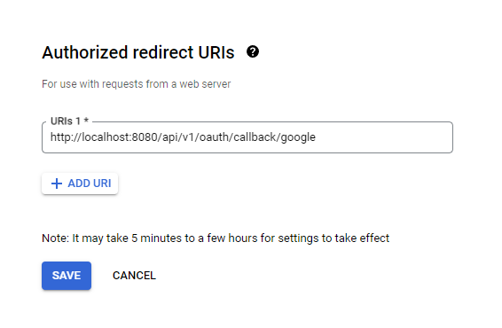

To enable Google Auth for your Infisical project, you first need to set up a Google OAuth application.
Follow Google's Setting up OAuth 2.0 documentation [here](https://support.google.com/googleapi/answer/6158849). After the setup, copy the Client ID and Client secret. You will need them below.

## Configure Redirect URI
Add the following URI to the Authorized redirect URIs section in the OAuth Client credentials page - `BASE_URL/api/v1/oauth/callback/google`. Replace BASE_URL with the URL of your hosted Infisical instance. 

## General Configuration
You wil need to configure the following [environment variables](https://infisical.com/docs/self-hosting/configuration/envars):

- `CLIENT_ID_GOOGLE`: OAuth 2.0 Client ID obtained from the credentials page
- `CLIENT_SECRET_GOOGLE`: OAuth 2.0 Client Secret obtained from the credentials page
