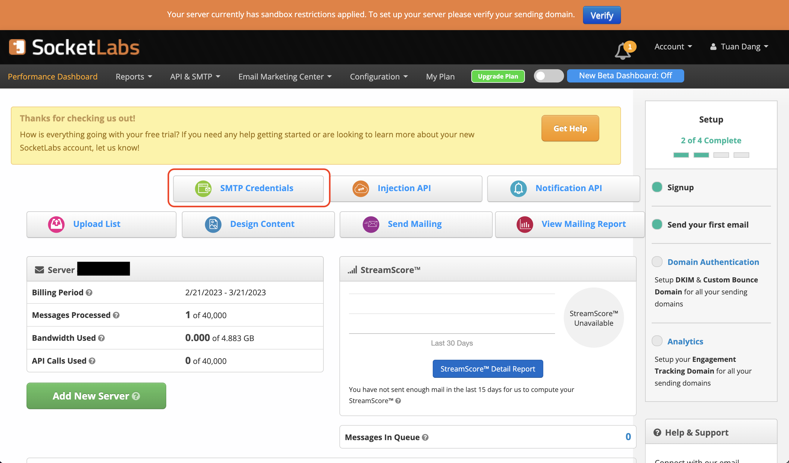
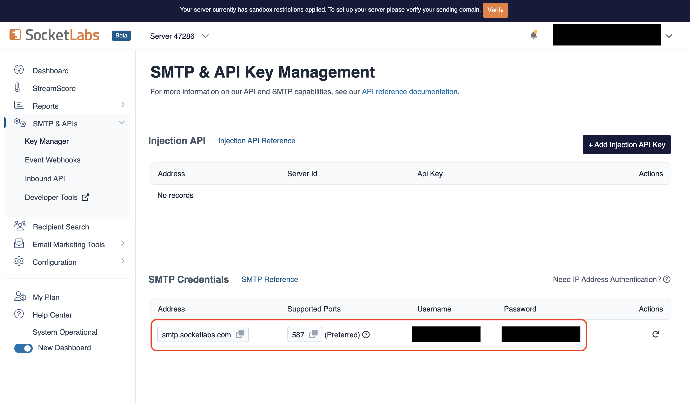
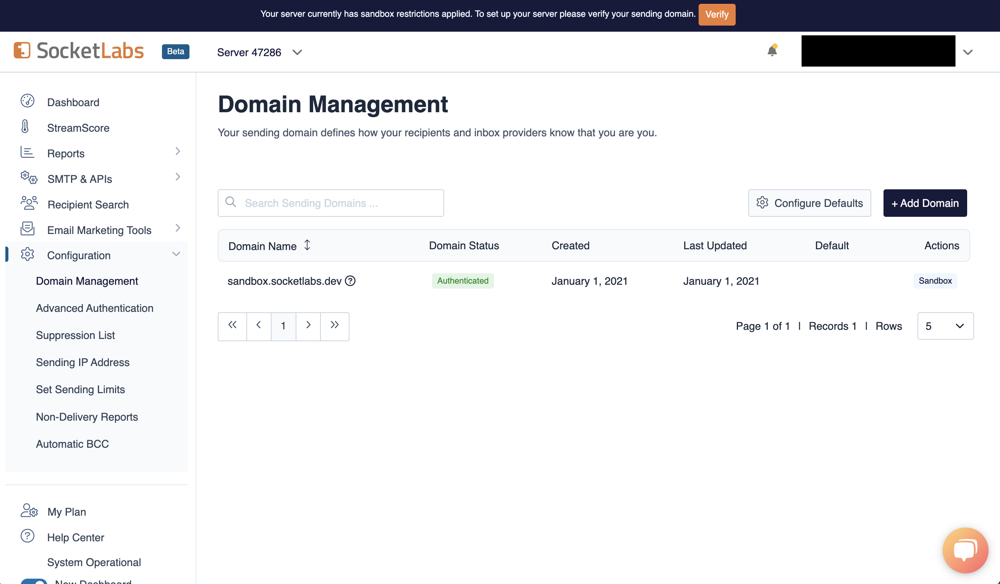
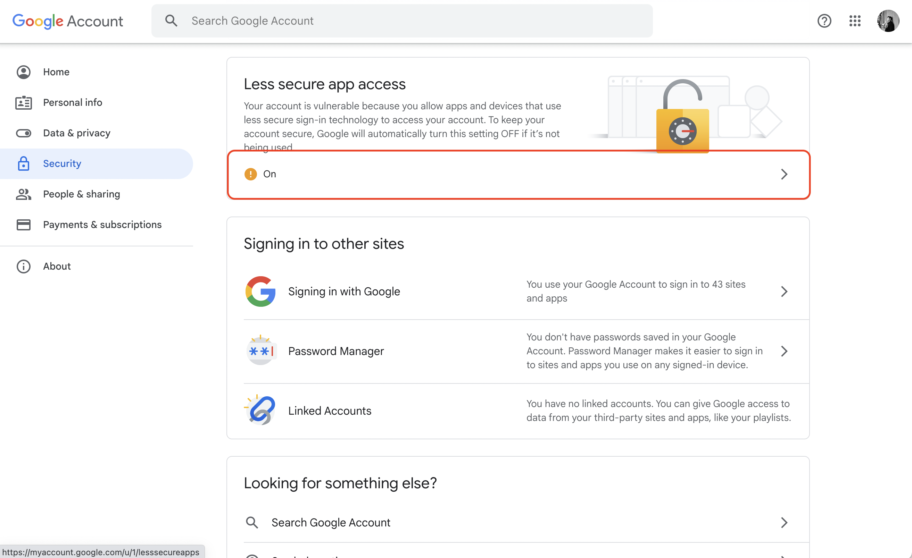

By default, the core functions of Infisical work without any email service configuration. Without email service, basic sign up/login and secret operations will function without any issue.
However, the following functionality will be disabled.

- Multi-factor authentication
- Sending invite links via email for projects to teammates
- Sending alerts such as suspicious login attempts

## Configuration

If you choose to setup email service, you need to configure the following SMTP [environment variables](https://infisical.com/docs/self-hosting/configuration/envars):

- `SMTP_HOST`: Hostname to connect to for establishing SMTP connections.
- `SMTP_USERNAME`: Credential to connect to host (e.g. team@infisical.com)
- `SMTP_PASSWORD`: Credential to connect to host.
- `SMTP_PORT`: Port to connect to for establishing SMTP connections.
- `SMTP_SECURE`: If `true`, the connection will use TLS when connecting to server with special configs for SendGrid and Mailgun. If `false` (the default) then TLS is used if server supports the STARTTLS extension.
- `SMTP_FROM_ADDRESS`: Email address to be used for sending emails (e.g. team@infisical.com).
- `SMTP_FROM_NAME`: Name label to be used in `From` field (e.g. Team).

Below you will find details on how to configure common email providers:

<AccordionGroup>
<Accordion title="Twilio SendGrid">

1. Create an account and configure [SendGrid](https://sendgrid.com) to send emails.
2. Create a SendGrid API Key under Settings > [API Keys](https://app.sendgrid.com/settings/api_keys)
3. Set a name for your API Key, we recommend using "Infisical," and select the "Restricted Key" option. You will need to enable the "Mail Send" permission as shown below:


4. With the API Key, you can now set your SMTP environment variables:

```
SMTP_HOST=smtp.sendgrid.net
SMTP_USERNAME=apikey
SMTP_PASSWORD=SG.rqFsfjxYPiqE1lqZTgD_lz7x8IVLx # your SendGrid API Key from step above
SMTP_PORT=587
SMTP_SECURE=true
SMTP_FROM_ADDRESS=hey@example.com # your email address being used to send out emails
SMTP_FROM_NAME=Infisical
```

  <Info>
    Remember that you will need to restart Infisical for this to work properly.
  </Info>
</Accordion>

<Accordion title="Mailgun">

1. Create an account and configure [Mailgun](https://www.mailgun.com) to send emails.
2. Obtain your Mailgun credentials in Sending > Overview > SMTP


3. With your Mailgun credentials, you can now set up your SMTP environment variables:

```
SMTP_HOST=smtp.mailgun.org # obtained from credentials page
SMTP_USERNAME=postmaster@example.mailgun.org # obtained from credentials page
SMTP_PASSWORD=password # obtained from credentials page
SMTP_PORT=587
SMTP_SECURE=true
SMTP_FROM_ADDRESS=hey@example.com # your email address being used to send out emails
SMTP_FROM_NAME=Infisical
```

</Accordion>

<Accordion title="AWS SES">

1. Create an account and [configure AWS SES](https://aws.amazon.com/premiumsupport/knowledge-center/ses-set-up-connect-smtp/) to send emails in the Amazon SES console.
2. Create an IAM user for SMTP authentication and obtain SMTP credentials in SMTP settings > Create SMTP credentials


3. With your AWS SES SMTP credentials, you can now set up your SMTP environment variables:

```
SMTP_HOST=email-smtp.ap-northeast-1.amazonaws.com # SMTP endpoint obtained from SMTP settings
SMTP_USERNAME=xxx # your SMTP username
SMTP_PASSWORD=xxx # your SMTP password
SMTP_PORT=587
SMTP_SECURE=true
SMTP_FROM_ADDRESS=hey@example.com # your email address being used to send out emails
SMTP_FROM_NAME=Infisical
```

<Info>
  Remember that you will need to restart Infisical for this to work properly.
</Info>
</Accordion>

<Accordion title="SocketLabs">

1. Create an account and configure [SocketLabs](https://www.socketlabs.com/) to send emails.
2. From the dashboard, navigate to SMTP Credentials > SMTP & APIs > SMTP Credentials to obtain your SocketLabs SMTP credentials.





3. With your SocketLabs SMTP credentials, you can now set up your SMTP environment variables:

```
SMTP_HOST=smtp.socketlabs.com
SMTP_USERNAME=username # obtained from your credentials
SMTP_PASSWORD=password # obtained from your credentials
SMTP_PORT=587
SMTP_SECURE=true
SMTP_FROM_ADDRESS=hey@example.com # your email address being used to send out emails
SMTP_FROM_NAME=Infisical
```

<Note>
  The `SMTP_FROM_ADDRESS` environment variable should be an email for an
  authenticated domain under Configuration > Domain Management in SocketLabs.
  For example, if you're using SocketLabs in sandbox mode, then you may use an
  email like `team@sandbox.socketlabs.dev`.
</Note>



<Info>
  Remember that you will need to restart Infisical for this to work properly.
</Info>
</Accordion>

<Accordion title="Gmail">

Create an account and enable "less secure app access" in Gmail Account Settings > Security. This will allow
applications like Infisical to authenticate with Gmail via your username and password.



With your Gmail username and password, you can set your SMTP environment variables:

```
SMTP_HOST=smtp.gmail.com
SMTP_USERNAME=hey@gmail.com # your email
SMTP_PASSWORD=password # your password
SMTP_PORT=587
SMTP_SECURE=true
SMTP_FROM_ADDRESS=hey@gmail.com
SMTP_FROM_NAME=Infisical
```

<Warning>
  As per the [notice](https://support.google.com/accounts/answer/6010255?hl=en) by Google, you should note that using Gmail credentials for SMTP configuration
  will only work for Google Workspace or Google Cloud Identity customers as of May 30, 2022.

Put differently, the SMTP configuration is only possible with business (not personal) Gmail credentials.

</Warning>

</Accordion>

<Accordion title="Office365">

1. Create an account and configure [Office365](https://www.office.com/) to send emails.

2. With your login credentials, you can now set up your SMTP environment variables:

```
SMTP_HOST=smtp.office365.com
SMTP_USERNAME=username@yourdomain.com # your username
SMTP_PASSWORD=password # your password
SMTP_PORT=587
SMTP_SECURE=true
SMTP_FROM_ADDRESS=username@yourdomain.com
SMTP_FROM_NAME=Infisical
```

</Accordion>

<Accordion title="Zoho Mail">

1. Create an account and configure [Zoho Mail](https://www.zoho.com/mail/) to send emails.

2. With your email credentials, you can now set up your SMTP environment variables:

```
SMTP_HOST=smtp.zoho.com
SMTP_USERNAME=username # your email
SMTP_PASSWORD=password # your password
SMTP_PORT=587
SMTP_SECURE=true
SMTP_FROM_ADDRESS=hey@example.com # your personal Zoho email or domain-based email linked to Zoho Mail
SMTP_FROM_NAME=Infisical
```

<Note>
  You can use either your personal Zoho email address like `you@zohomail.com` or
  a domain-based email address like `you@yourdomain.com`. If using a
  domain-based email address, then please make sure that you've configured and
  verified it with Zoho Mail.
</Note>

<Info>
  Remember that you will need to restart Infisical for this to work properly.
</Info>
</Accordion>

</AccordionGroup>
