Infisical accepts all configurations via environment variables. For a minimal self-hosted instance, at least `ENCRYPTION_KEY`, `AUTH_SECRET`, `DB_CONNECTION_URI` and `REDIS_URL` must be defined.
However, you can configure additional settings to activate more features as needed.

## General platform

Used to configure platform-specific security and operational settings

<ParamField query="ENCRYPTION_KEY" type="string" default="none" required>
  Must be a random 16 byte hex string. Can be generated with `openssl rand -hex
  16`
</ParamField>

<ParamField query="AUTH_SECRET" type="string" default="none" required>
  Must be a random 32 byte base64 string. Can be generated with `openssl rand
  -base64 32`
</ParamField>

<ParamField query="SITE_URL" type="string" default="none" required>
  Must be an absolute URL including the protocol (e.g.
  https://app.infisical.com).
</ParamField>

<ParamField query="PORT" type="int" default="8080" optional>
  Specifies the internal port on which the application listens.
</ParamField>

<ParamField query="HOST" type="string" default="localhost" optional>
  Specifies the network interface Infisical will bind to when accepting incoming connections.

By default, Infisical binds to `localhost`, which restricts access to connections from the same machine.

To make the application accessible externally (e.g., for self-hosted deployments), set this to `0.0.0.0`, which tells the server to listen on all network interfaces.

Example values:

- `localhost` (default, same as `127.0.0.1`)
- `0.0.0.0` (all interfaces, accessible externally)
- `192.168.1.100` (specific interface IP)

</ParamField>

<ParamField query="TELEMETRY_ENABLED" type="string" default="true" optional>
  Telemetry helps us improve Infisical but if you want to disable it you may set
  this to `false`.
</ParamField>

<ParamField
  query="ALLOW_INTERNAL_IP_CONNECTIONS"
  type="bool"
  default="false"
  optional
>
  Determines whether App Connections and Dynamic Secrets are permitted to
  connect with internal/private IP addresses.
</ParamField>

<ParamField
  query="KUBERNETES_AUTO_FETCH_SERVICE_ACCOUNT_TOKEN"
  type="bool"
  default="false"
  optional
>
  Determines whether your Infisical instance can automatically read the service
  account token of the pod it's running on. Used for features such as the IRSA
  auth method.
</ParamField>

<ParamField query="DISABLE_AUDIT_LOG_STORAGE" type="string" default="false">
  Disable storing audit logs in the database. This is useful if you're using
  audit log streams and don't want to store them in the database.
</ParamField>

## CORS

Cross-Origin Resource Sharing (CORS) is a security feature that allows web applications running on one domain to access resources from another domain.
The following environment variables can be used to configure the Infisical Rest API to allow or restrict access to resources from different origins.

<ParamField query="CORS_ALLOWED_ORIGINS" type="string" optional>

Specify a list of origins that are allowed to access the Infisical API.

An example value would be `CORS_ALLOWED_ORIGINS=["https://example.com"]`.

Defaults to the same value as your `SITE_URL` environment variable.

</ParamField>

<ParamField query="CORS_ALLOWED_METHODS" type="string" optional>
  Array of HTTP methods allowed for CORS requests.

Defaults to reflecting the headers specified in the request's Access-Control-Request-Headers header.

</ParamField>

## Data Layer

The platform utilizes Postgres to persist all of its data and Redis for caching and backgroud tasks

### PostgreSQL

<Info>
  Please note that the database user you create must be granted all privileges
  on the Infisical database. This includes the ability to create new schemas,
  create, update, delete, modify tables and indexes, etc.
</Info>

<ParamField query="DB_CONNECTION_URI" type="string" default="" required>
  Postgres database connection string.
</ParamField>

<ParamField query="DB_ROOT_CERT" type="string" default="" optional>
  Configure the SSL certificate for securing a Postgres connection by first encoding it in base64.
  Use the following command to encode your certificate: `echo "<certificate>" | base64`

  Many cloud providers provide a CA certificate for their data regions that you can use to secure your connection with SSL.

  <AccordionGroup>
    <Accordion title="AWS RDS">
      If you're hosting your database on AWS RDS, you can use their publicly available CA certificate as the database root certificate.

      You can find all the available CA certificates for AWS RDS on the official [AWS RDS documentation](https://docs.aws.amazon.com/AmazonRDS/latest/UserGuide/UsingWithRDS.SSL.html).

      As an example, if your RDS cluster is hosted in `us-east-1` _(US East, N. Virginia)_, you can use the following root certificate: https://truststore.pki.rds.amazonaws.com/us-east-1/us-east-1-bundle.pem.

      All the available CA certificates can be found in the AWS RDS documentation linked above.

      Remember to base64 encode the certificate before setting it as the `DB_ROOT_CERT` environment variable. `cat /path/to/certificate.pem | base64`.

      ```bash
      DB_ROOT_CERT=LS0tLS1CRUdJTiBDRVJUSUZJQ0FURS0tLS0tCk1 # .... (base64 encoded certificate)
      DB_CONNECTION_URI=<rds-endpoint>?sslmode=verify-ca # or verify-full depending on your security policies
      ```
    </Accordion>
  </AccordionGroup>
</ParamField>

<ParamField query="DB_READ_REPLICAS" type="string" default="" optional>
  Postgres database read replica connection strings. It accepts a JSON string.
```
DB_READ_REPLICAS=[{"DB_CONNECTION_URI":""}]
```
  <Expandable title="Format">
	  <ParamField query="DB_CONNECTION_URI" type="string" default="" required>
	    Postgres read replica connection string.
    </ParamField>
    <ParamField query="DB_ROOT_CERT" type="string" default="" optional>
      Configure the SSL certificate for securing a Postgres replica connection by first encoding it in base64.
	    Use the following command to encode your certificate: `echo "<certificate>" | base64`

      If not provided it will use master SSL certificate.
    </ParamField>

  </Expandable>
</ParamField>

### Redis

Redis is used for caching and background tasks. You can use either a standalone Redis instance, Redis Sentinel, or Redis Cluster setup.

<Tabs>
  <Tab title="Redis Standalone">
    <ParamField query="REDIS_URL" type="string" default="none" required>
      Redis connection string. For SSL/TLS connections, use the `rediss://` protocol (note the double 's').
      
      Examples:
      - Without SSL: `redis://localhost:6379`
      - With SSL: `rediss://localhost:6379`
      - With authentication: `redis://:password@localhost:6379`
      - With SSL and authentication: `rediss://:password@localhost:6379`
    </ParamField>
  </Tab>
  <Tab title="Redis Sentinel">
    <ParamField
      query="REDIS_SENTINEL_HOSTS"
      type="string"
      default="none"
      required
    >
      Comma-separated list of Sentinel host:port pairs. ```
      192.168.65.254:26379,192.168.65.254:26380 ```
    </ParamField>
    <ParamField
      query="REDIS_SENTINEL_MASTER_NAME"
      type="string"
      default="mymaster"
    >
      The name of the Redis master set monitored by Sentinel
    </ParamField>
    <ParamField query="REDIS_SENTINEL_ENABLE_TLS" type="bool" default="false">
      Whether to use TLS/SSL for Redis Sentinel connection
    </ParamField>
    <ParamField query="REDIS_SENTINEL_USERNAME" type="string" default="none">
      Authentication username for Redis Sentinel
    </ParamField>
    <ParamField query="REDIS_SENTINEL_PASSWORD" type="string" default="none">
      Authentication password for Redis Sentinel
    </ParamField>
    <ParamField query="REDIS_USERNAME" type="string" default="none">
      Authentication username for Redis Node
    </ParamField>
    <ParamField query="REDIS_PASSWORD" type="string" default="none">
      Authentication password for Redis Node
    </ParamField>
  </Tab>
  <Tab title="Redis Cluster">
    <ParamField
      query="REDIS_CLUSTER_HOSTS"
      type="string"
      default="none"
      required
    >
      Comma-separated list of Redis Cluster host:port pairs. ```
      192.168.65.254:26379,192.168.65.254:26380 ```
    </ParamField>
    <ParamField query="REDIS_CLUSTER_ENABLE_TLS" type="boolean" default="false">
      Enable Redis TLS encryption on connection.
    </ParamField>
    <ParamField query="REDIS_CLUSTER_AWS_ELASTICACHE_DNS_LOOKUP_MODE" type="boolean" default="false">
      Enable this if you are using AWS encrypt on transit for Elasticache cluster. For more information refer .
    </ParamField>
    <ParamField query="REDIS_USERNAME" type="string" default="none">
      Authentication username for Redis Node
    </ParamField>
    <ParamField query="REDIS_PASSWORD" type="string" default="none">
      Authentication password for Redis Node
    </ParamField>
  </Tab>
  <Tab title="Redis Read Replica">
    <ParamField
      query="REDIS_READ_REPLICAS"
      type="string"
      default="none"
      optional
    >
      Comma-separated list of Redis read replicas host:port pairs. ```
      192.168.65.254:26379,192.168.65.254:26380 ```
    </ParamField>

    The paramters like username, password, tls, redis type of the primary instance will be inherited.

  </Tab>
</Tabs>

### Redis with SSL/TLS

To connect to Redis with SSL/TLS, use the `rediss://` protocol (note the double 's') in your connection string.

If your Redis server uses a certificate signed by a private CA or a self-signed certificate, set the `NODE_EXTRA_CA_CERTS` environment variable to the path of your CA certificate file:

```bash
REDIS_URL=rediss://your-redis-host:6379
NODE_EXTRA_CA_CERTS=/path/to/ca.crt
```

For Redis Sentinel or Cluster mode, use the `REDIS_SENTINEL_ENABLE_TLS` or `REDIS_CLUSTER_ENABLE_TLS` environment variables respectively.

## Email Service

Without email configuration, Infisical's core functions like sign-up/login and secret operations work, but this disables multi-factor authentication, email invites for projects, alerts for suspicious logins, and all other email-dependent features.

<Accordion title="Generic Configuration">
<ParamField query="SMTP_HOST" type="string" default="none" optional>
  Hostname to connect to for establishing SMTP connections
</ParamField>

<ParamField query="SMTP_PORT" type="string" default="587" optional>
  Port to connect to for establishing SMTP connections
</ParamField>

<ParamField query="SMTP_USERNAME" type="string" default="none" optional>
  Credential to connect to host (e.g. team@infisical.com)
</ParamField>

<ParamField query="SMTP_PASSWORD" type="string" default="none" optional>
  Credential to connect to host
</ParamField>

<ParamField query="SMTP_FROM_ADDRESS" type="string" default="none" optional>
  Email address to be used for sending emails
</ParamField>

<ParamField query="SMTP_FROM_NAME" type="string" default="none" optional>
  Name label to be used in From field (e.g. Team)
</ParamField>

<ParamField query="SMTP_IGNORE_TLS" type="bool" default="false" optional>
  If this is `true` and `SMTP_PORT` is not 465 then TLS is not used even if the
  server supports STARTTLS extension.
</ParamField>

<ParamField query="SMTP_REQUIRE_TLS" type="bool" default="true" optional>
  If this is `true` and `SMTP_PORT` is not 465 then Infisical tries to use
  STARTTLS even if the server does not advertise support for it. If the
  connection can not be encrypted then message is not sent.
</ParamField>

<ParamField
  query="SMTP_TLS_REJECT_UNAUTHORIZED"
  type="bool"
  default="true"
  optional
>
  If this is `true`, Infisical will validate the server's SSL/TLS certificate
  and reject the connection if the certificate is invalid or not trusted. If set
  to `false`, the client will accept the server's certificate regardless of its
  validity, which can be useful in development or testing environments but is
  not recommended for production use.
</ParamField>

<ParamField query="SMTP_CUSTOM_CA_CERT" type="string" default="none" optional>
    If your SMTP server uses a certificate signed by a custom Certificate Authority, you should set this variable so that Infisical can trust the custom CA.

    This variable **must be a base64 encoded PEM certificate**. Use the following command to encode your certificate: `echo "<certificate>" | base64`

    Infisical highly encourages the following variables be used alongside this one for maximum security:
    - `SMTP_REQUIRE_TLS=true`
    - `SMTP_TLS_REJECT_UNAUTHORIZED=true`

</ParamField>
</Accordion>

<Accordion title="Twilio SendGrid">

1. Create an account and configure [SendGrid](https://sendgrid.com) to send emails.
2. Create a SendGrid API Key under Settings > [API Keys](https://app.sendgrid.com/settings/api_keys)
3. Set a name for your API Key, we recommend using "Infisical," and select the "Restricted Key" option. You will need to enable the "Mail Send" permission as shown below:

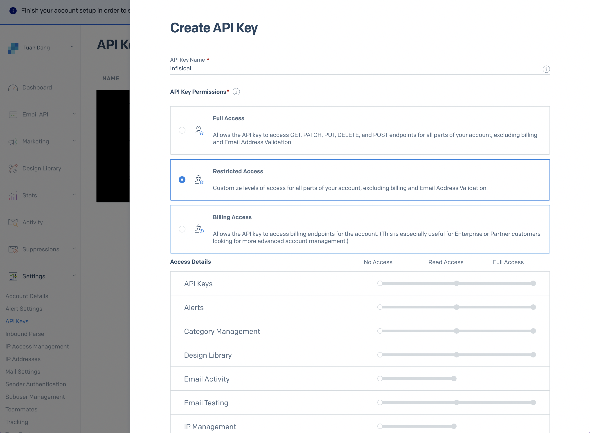

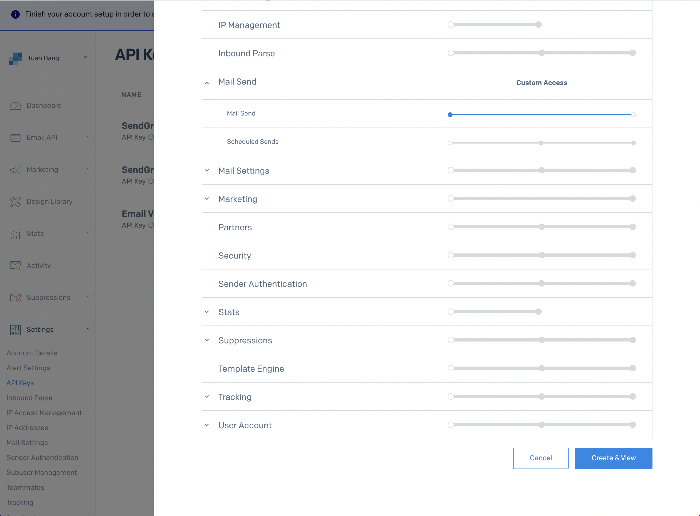

4. With the API Key, you can now set your SMTP environment variables:

```
SMTP_HOST=smtp.sendgrid.net
SMTP_USERNAME=apikey
SMTP_PASSWORD=SG.rqFsfjxYPiqE1lqZTgD_lz7x8IVLx # your SendGrid API Key from step above
SMTP_PORT=587
SMTP_FROM_ADDRESS=hey@example.com # your email address being used to send out emails
SMTP_FROM_NAME=Infisical
```

  <Info>
    Remember that you will need to restart Infisical for this to work properly.
  </Info>
</Accordion>

<Accordion title="Mailgun">
  1. Create an account and configure [Mailgun](https://www.mailgun.com) to send emails.
  2. Obtain your Mailgun credentials in Sending > Overview > SMTP

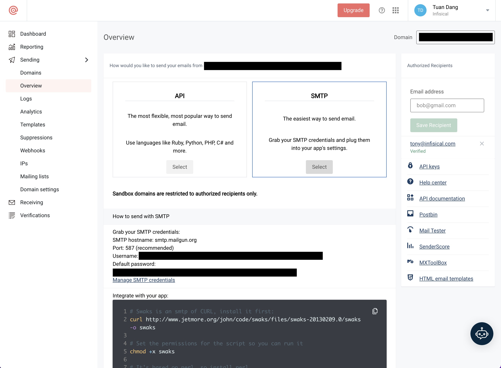

3. With your Mailgun credentials, you can now set up your SMTP environment variables:

```
SMTP_HOST=smtp.mailgun.org # obtained from credentials page
SMTP_USERNAME=postmaster@example.mailgun.org # obtained from credentials page
SMTP_PASSWORD=password # obtained from credentials page
SMTP_PORT=587
SMTP_FROM_ADDRESS=hey@example.com # your email address being used to send out emails
SMTP_FROM_NAME=Infisical
```

</Accordion>

<Accordion title="AWS SES">
  <Steps>
    <Step title="Create a verifed identity">
      This will be used to verify the email you are sending from.
      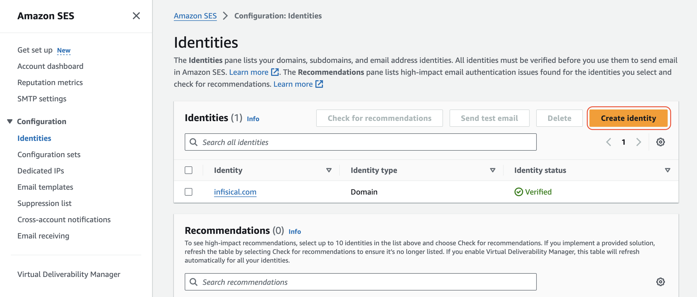
      <Info>
        If you AWS SES is under sandbox mode, you will only be able to send emails to verified identies.
      </Info>
    </Step>
    <Step title="Create an account and configure AWS SES">
      Create an IAM user for SMTP authentication and obtain SMTP credentials in SMTP settings > Create SMTP credentials

      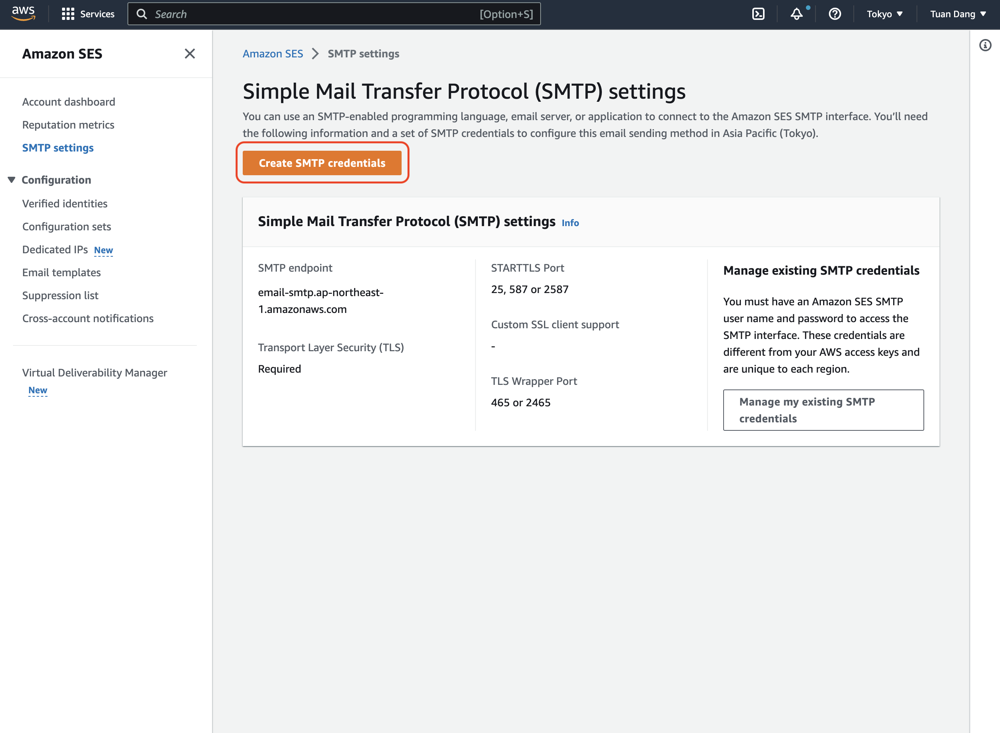

      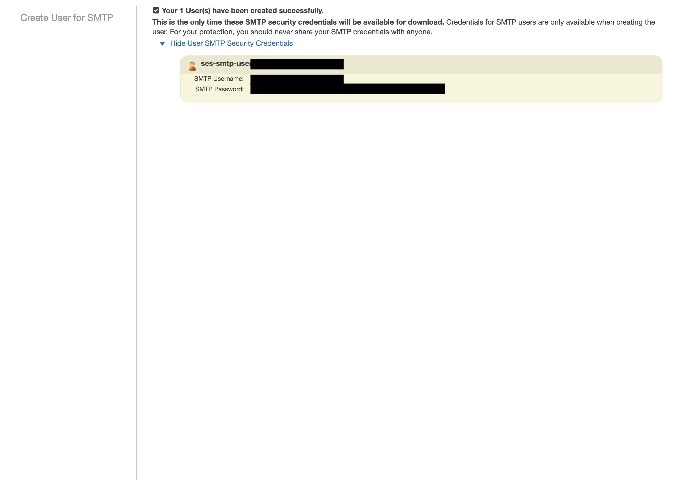
    </Step>
    <Step title="Set up your SMTP environment variables">
      With your AWS SES SMTP credentials, you can now set up your SMTP environment variables for your Infisical instance.

      ```
      SMTP_HOST=email-smtp.ap-northeast-1.amazonaws.com # SMTP endpoint obtained from SMTP settings
      SMTP_USERNAME=xxx # your SMTP username
      SMTP_PASSWORD=xxx # your SMTP password
      SMTP_PORT=465
      SMTP_FROM_ADDRESS=hey@example.com # your email address being used to send out emails
      SMTP_FROM_NAME=Infisical
      ```
    </Step>

  </Steps>

  <Info>
    Remember that you will need to restart Infisical for this to work properly.
  </Info>
</Accordion>

<Accordion title="SocketLabs">
  1. Create an account and configure [SocketLabs](https://www.socketlabs.com/) to send emails.
  2. From the dashboard, navigate to SMTP Credentials > SMTP & APIs > SMTP Credentials to obtain your SocketLabs SMTP credentials.

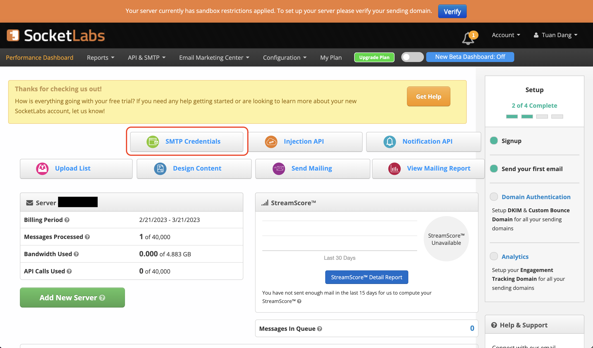

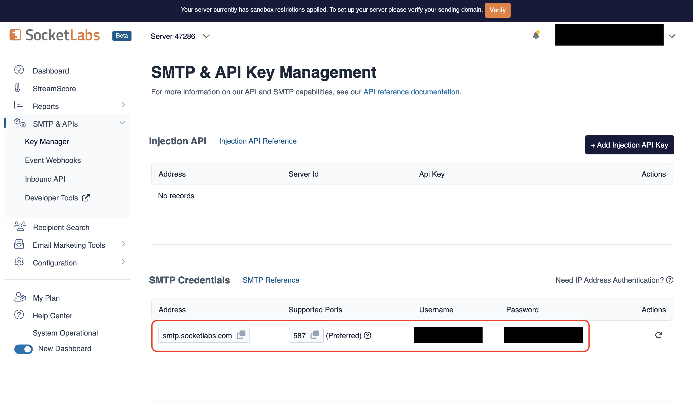

3. With your SocketLabs SMTP credentials, you can now set up your SMTP environment variables:

```
SMTP_HOST=smtp.socketlabs.com
SMTP_USERNAME=username # obtained from your credentials
SMTP_PASSWORD=password # obtained from your credentials
SMTP_PORT=587
SMTP_FROM_ADDRESS=hey@example.com # your email address being used to send out emails
SMTP_FROM_NAME=Infisical
```

{" "}

<Note>
  The `SMTP_FROM_ADDRESS` environment variable should be an email for an
  authenticated domain under Configuration > Domain Management in SocketLabs.
  For example, if you're using SocketLabs in sandbox mode, then you may use an
  email like `team@sandbox.socketlabs.dev`.
</Note>

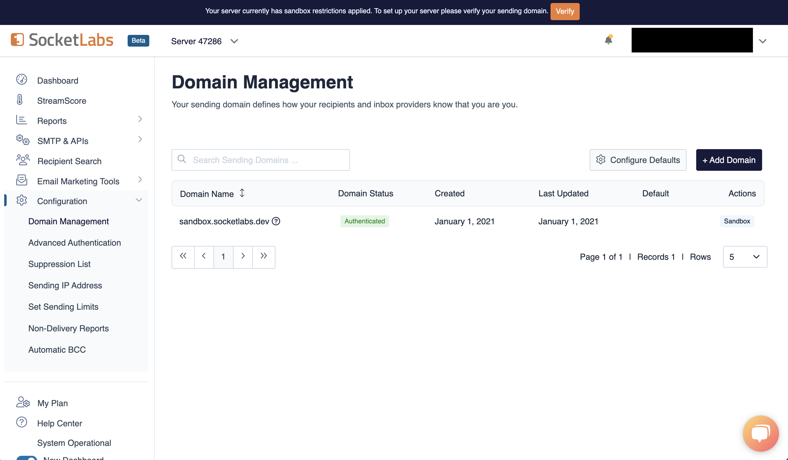

  <Info>
    Remember that you will need to restart Infisical for this to work properly.
  </Info>
</Accordion>

<Accordion title="Resend">
  1. Create an account on [Resend](https://resend.com).
  2. Add a [Domain](https://resend.com/domains).

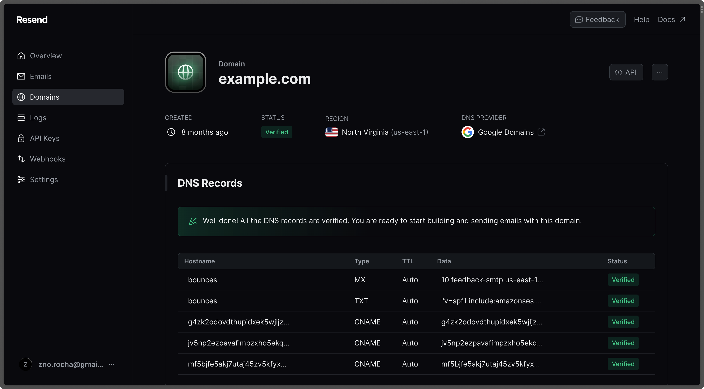

3. Create an [API Key](https://resend.com/api-keys).

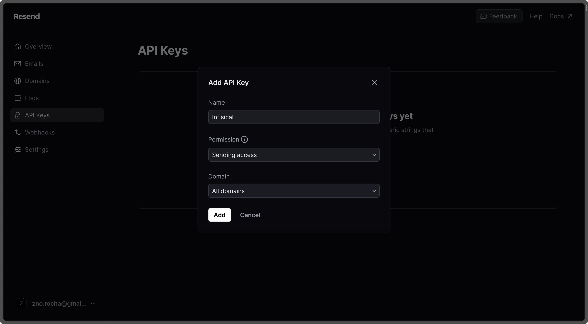

4. Go to the [SMTP page](https://resend.com/settings/smtp) and copy the values.

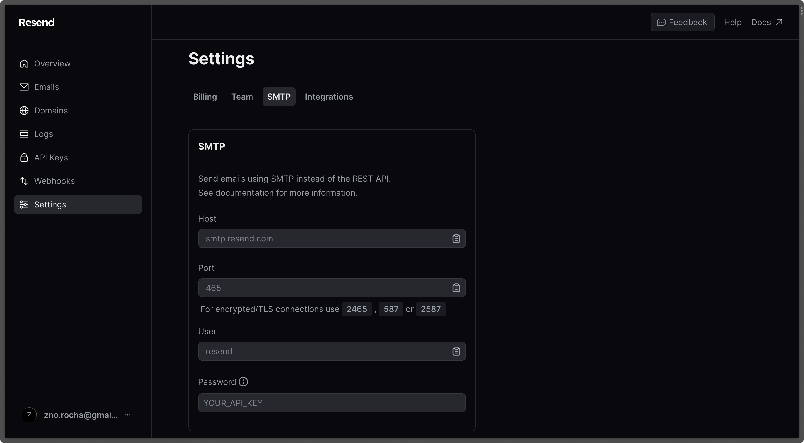

5. With the API Key, you can now set your SMTP environment variables variables:

```
SMTP_HOST=smtp.resend.com
SMTP_USERNAME=resend
SMTP_PASSWORD=YOUR_API_KEY
SMTP_PORT=587
SMTP_FROM_ADDRESS=hey@example.com # your email address being used to send out emails
SMTP_FROM_NAME=Infisical
```

    <Info>
      Remember that you will need to restart Infisical for this to work properly.
    </Info>

</Accordion>

<Accordion title="Gmail">
  Create an account and enable "less secure app access" in Gmail Account Settings > Security. This will allow
  applications like Infisical to authenticate with Gmail via your username and password.

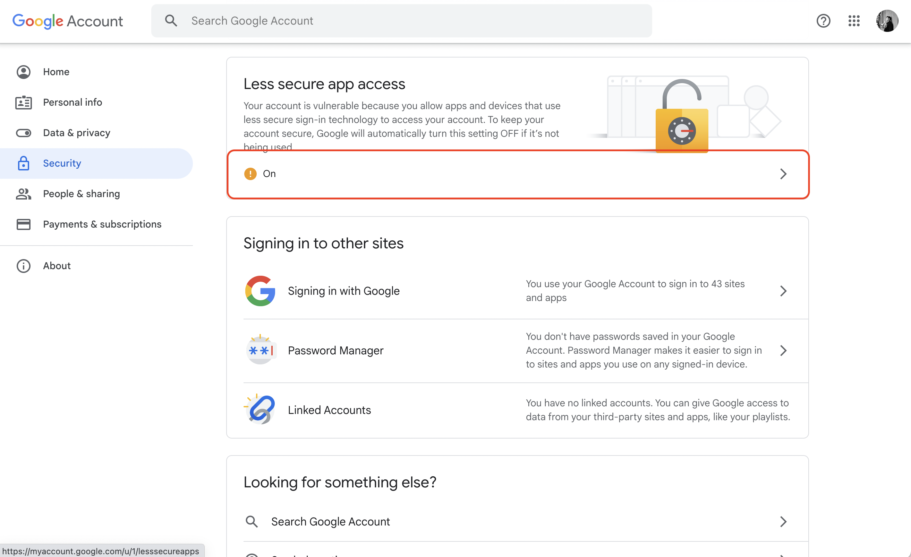

With your Gmail username and password, you can set your SMTP environment variables:

```
SMTP_HOST=smtp.gmail.com
SMTP_USERNAME=hey@gmail.com # your email
SMTP_PASSWORD=password # your password
SMTP_PORT=587
SMTP_FROM_ADDRESS=hey@gmail.com
SMTP_FROM_NAME=Infisical
```

  <Warning>
    As per the [notice](https://support.google.com/accounts/answer/6010255?hl=en) by Google, you should note that using Gmail credentials for SMTP configuration
    will only work for Google Workspace or Google Cloud Identity customers as of May 30, 2022.

Put differently, the SMTP configuration is only possible with business (not personal) Gmail credentials.

  </Warning>
</Accordion>

<Accordion title="Office365">
  1. Create an account and configure [Office365](https://www.office.com/) to send emails.

2. With your login credentials, you can now set up your SMTP environment variables:

```
SMTP_HOST=smtp.office365.com
SMTP_USERNAME=username@yourdomain.com # your username
SMTP_PASSWORD=password # your password
SMTP_PORT=587
SMTP_FROM_ADDRESS=username@yourdomain.com
SMTP_FROM_NAME=Infisical
```

</Accordion>

<Accordion title="Zoho Mail">
  1. Create an account and configure [Zoho Mail](https://www.zoho.com/mail/) to send emails.

2. With your email credentials, you can now set up your SMTP environment variables:

```
SMTP_HOST=smtp.zoho.com
SMTP_USERNAME=username # your email
SMTP_PASSWORD=password # your password
SMTP_PORT=587
SMTP_FROM_ADDRESS=hey@example.com # your personal Zoho email or domain-based email linked to Zoho Mail
SMTP_FROM_NAME=Infisical
```

{" "}

<Note>
  You can use either your personal Zoho email address like `you@zohomail.com` or
  a domain-based email address like `you@yourdomain.com`. If using a
  domain-based email address, then please make sure that you've configured and
  verified it with Zoho Mail.
</Note>

  <Info>
    Remember that you will need to restart Infisical for this to work properly.
  </Info>
</Accordion>

<Accordion title="SMTP2Go">
1. Create an account and configure [SMTP2Go](https://www.smtp2go.com/) to send emails.
2. Turn on SMTP authentication
```
SMTP_HOST=mail.smtp2go.com
SMTP_PORT=You can use one of the following ports: 2525, 80, 25, 8025, or 587
SMTP_USERNAME=username #Your SMTP2GO account's SMTP username
SMTP_PASSWORD=password #Your SMTP2GO account's SMTP password
SMTP_FROM_ADDRESS=hey@example.com # your email address being used to send out emails
SMTP_FROM_NAME=Infisical
```
{" "}

<Note>
Optional (for TLS/SSL):

TLS: Available on the same ports (2525, 80, 25, 8025, or 587)
SSL: Available on ports 465, 8465, and 443

</Note>
</Accordion>

## Authentication

By default, users can only login via email/password based login method.
To login into Infisical with OAuth providers such as Google, configure the associated variables.

<ParamField query="DEFAULT_SAML_ORG_SLUG" type="string">

When set, all visits to the Infisical login page will automatically redirect users of your Infisical instance to the SAML identity provider associated with the specified organization slug.

</ParamField>

<Accordion title="Google">
  Follow detailed guide to configure [Google SSO](/documentation/platform/sso/google)

  <ParamField query="CLIENT_ID_GOOGLE_LOGIN" type="string" default="none" optional>
  OAuth2 client ID for Google login
  </ParamField>
  <ParamField query="CLIENT_SECRET_GOOGLE_LOGIN" type="string" default="none" optional>
    OAuth2 client secret for Google login
  </ParamField>
</Accordion>

<Accordion title="Github">
  Follow detailed guide to configure [GitHub SSO](/documentation/platform/sso/github)

  <ParamField query="CLIENT_ID_GITHUB_LOGIN" type="string" default="none" optional>
    OAuth2 client ID for GitHub login
  </ParamField>
  <ParamField query="CLIENT_SECRET_GITHUB_LOGIN" type="string" default="none" optional>
    OAuth2 client secret for GitHub login
  </ParamField>
</Accordion>

<Accordion title="Gitlab">
  Follow detailed guide to configure [GitLab SSO](/documentation/platform/sso/gitlab)

  <ParamField query="CLIENT_ID_GITLAB_LOGIN" type="string" default="none" optional>
    OAuth2 client ID for GitLab login
  </ParamField>
  <ParamField query="CLIENT_SECRET_GITLAB_LOGIN" type="string" default="none" optional>
    OAuth2 client secret for GitLab login
  </ParamField>
  <ParamField query="URL_GITLAB_LOGIN" type="string" default="https://gitlab.com" optional>
    URL of your self-hosted instance of GitLab where the OAuth application is registered
  </ParamField>
</Accordion>

<Accordion title="Okta SAML">
  Requires enterprise license. Please contact team@infisical.com to get more
  information.
</Accordion>

<Accordion title="Azure SAML">
  Requires enterprise license. Please contact team@infisical.com to get more
  information.
</Accordion>

<Accordion title="JumpCloud SAML">
  Requires enterprise license. Please contact team@infisical.com to get more
  information.
</Accordion>

## App Connections

You can configure third-party app connections for re-use across Infisical Projects.

<Accordion title="AWS Assume Role Connection">
    <ParamField query="INF_APP_CONNECTION_AWS_ACCESS_KEY_ID" type="string" default="none" optional>
        The AWS IAM User access key ID for assuming roles
    </ParamField>

    <ParamField query="INF_APP_CONNECTION_AWS_SECRET_ACCESS_KEY" type="string" default="none" optional>
        The AWS IAM User secret key for assuming roles
    </ParamField>

</Accordion>

<Accordion title="GitHub App Connection">
    <ParamField query="INF_APP_CONNECTION_GITHUB_APP_ID" type="string" default="none" optional>
        The ID of the GitHub App
    </ParamField>

    <ParamField query="INF_APP_CONNECTION_GITHUB_APP_SLUG" type="string" default="none" optional>
        The slug of the GitHub App
    </ParamField>

    <ParamField query="INF_APP_CONNECTION_GITHUB_APP_CLIENT_ID" type="string" default="none" optional>
        The client ID for the GitHub App
    </ParamField>

    <ParamField query="INF_APP_CONNECTION_GITHUB_APP_CLIENT_SECRET" type="string" default="none" optional>
        The client secret for the GitHub App
    </ParamField>

    <ParamField query="INF_APP_CONNECTION_GITHUB_APP_PRIVATE_KEY" type="string" default="none" optional>
        The private key for the GitHub App
    </ParamField>

</Accordion>

<Accordion title="GitHub Radar App Connection">
    <ParamField query="INF_APP_CONNECTION_GITHUB_RADAR_APP_ID" type="string" default="none" optional>
        The ID of the GitHub Radar App
    </ParamField>

    <ParamField query="INF_APP_CONNECTION_GITHUB_RADAR_APP_SLUG" type="string" default="none" optional>
        The slug of the GitHub Radar App
    </ParamField>

    <ParamField query="INF_APP_CONNECTION_GITHUB_RADAR_APP_CLIENT_ID" type="string" default="none" optional>
        The client ID for the GitHub Radar App
    </ParamField>

    <ParamField query="INF_APP_CONNECTION_GITHUB_RADAR_APP_CLIENT_SECRET" type="string" default="none" optional>
        The client secret for the GitHub Radar App
    </ParamField>

    <ParamField query="INF_APP_CONNECTION_GITHUB_RADAR_APP_PRIVATE_KEY" type="string" default="none" optional>
        The private key for the GitHub Radar App
    </ParamField>

    <ParamField query="INF_APP_CONNECTION_GITHUB_RADAR_APP_WEBHOOK_SECRET" type="string" default="none" optional>
        The webhook secret configured for payload verification in the GitHub Radar App
    </ParamField>

</Accordion>

<Accordion title="GitHub OAuth Connection">
    <ParamField query="INF_APP_CONNECTION_GITHUB_OAUTH_CLIENT_ID" type="string" default="none" optional>
        The OAuth2 client ID for GitHub OAuth Connection
    </ParamField>

    <ParamField query="INF_APP_CONNECTION_GITHUB_OAUTH_CLIENT_SECRET" type="string" default="none" optional>
        The OAuth2 client secret for GitHub OAuth Connection
    </ParamField>

</Accordion>

<Accordion title="GitLab OAuth Connection">
    <ParamField query="INF_APP_CONNECTION_GITLAB_OAUTH_CLIENT_ID" type="string" default="none" optional>
        The Application ID of your GitLab OAuth application.
    </ParamField>

    <ParamField query="INF_APP_CONNECTION_GITLAB_OAUTH_CLIENT_SECRET" type="string" default="none" optional>
        The Secret of your GitLab OAuth application.
    </ParamField>

</Accordion>

<Accordion title="Heroku OAuth Connection">
    <ParamField query="INF_APP_CONNECTION_HEROKU_OAUTH_CLIENT_ID" type="string" default="none" optional>
        The Application ID of your Heroku OAuth application.
    </ParamField>

    <ParamField query="INF_APP_CONNECTION_HEROKU_OAUTH_CLIENT_SECRET" type="string" default="none" optional>
        The Secret of your Heroku OAuth application.
    </ParamField>
</Accordion>

## Secret Scanning

<Accordion title="GitHub">
  <ParamField query="SECRET_SCANNING_GIT_APP_ID" type="string" default="none" optional>
    The App ID of your GitHub App.
  </ParamField>

{" "}

<ParamField
  query="SECRET_SCANNING_GIT_APP_SLUG"
  type="string"
  default="none"
  optional
>
  The slug of your GitHub App.
</ParamField>

{" "}

<ParamField
  query="SECRET_SCANNING_PRIVATE_KEY"
  type="string"
  default="none"
  optional
>
  A private key for your GitHub App.
</ParamField>

  <ParamField query="SECRET_SCANNING_WEBHOOK_SECRET" type="string" default="none" optional>
    The webhook secret of your GitHub App.
  </ParamField>
</Accordion>

## Observability

You can configure Infisical to collect and expose telemetry data for analytics and monitoring.

<ParamField
  query="OTEL_TELEMETRY_COLLECTION_ENABLED"
  type="string"
  default="false"
>
  Whether or not to collect and expose telemetry data.
</ParamField>

<ParamField query="OTEL_EXPORT_TYPE" type="enum" optional>
  Supported types are `prometheus` and `otlp`.

If export type is set to `prometheus`, metric data will be exposed in port 9464 in the `/metrics` path.

If export type is set to `otlp`, you will have to configure a value for `OTEL_EXPORT_OTLP_ENDPOINT`.

</ParamField>

<ParamField query="OTEL_EXPORT_OTLP_ENDPOINT" type="string">
  Where telemetry data would be pushed to for collection. This is only
  applicable when `OTEL_EXPORT_TYPE` is set to `otlp`.
</ParamField>

<ParamField query="OTEL_COLLECTOR_BASIC_AUTH_USERNAME" type="string">
  The username for authenticating with the telemetry collector.
</ParamField>
<ParamField query="OTEL_COLLECTOR_BASIC_AUTH_PASSWORD" type="string">
  The password for authenticating with the telemetry collector.
</ParamField>

## Identity Auth Method

<ParamField
  query="IDENTITY_TLS_CERT_AUTH_CLIENT_CERTIFICATE_HEADER_KEY"
  type="string"
  default="x-identity-tls-cert-auth-client-cert"
>
  The TLS header used to propagate the client certificate from the load balancer
  to the server.
</ParamField>

## Environment Variable Overrides

If you can't directly access and modify environment variables, you can update them using the [Server Admin Console](/documentation/platform/admin-panel/server-admin).

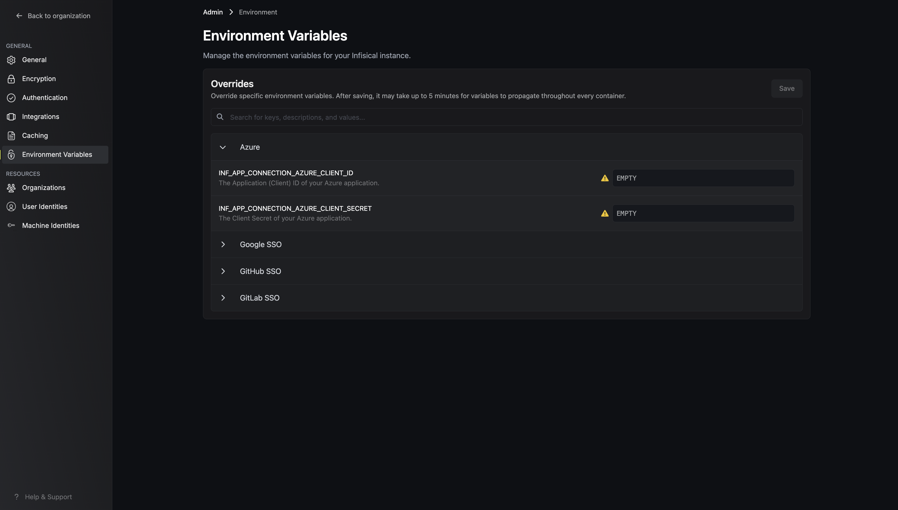
