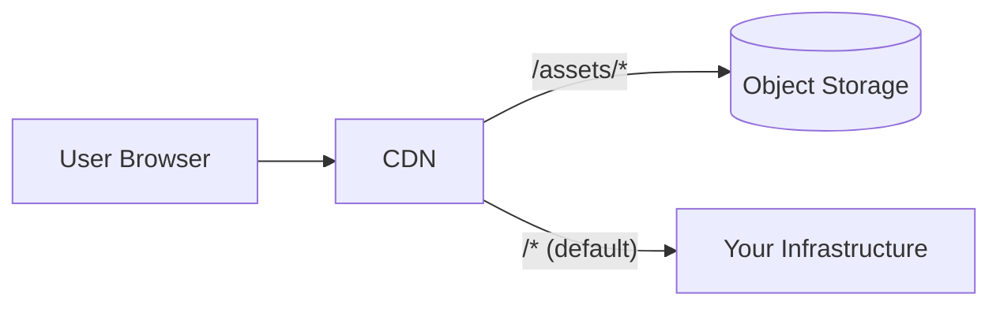

This guide explains a common issue with frontend asset caching during deployments and how to solve it using a CDN.

## The Problem: Version Skew

Modern frontend build tools like Vite generate content-hashed filenames for static assets (e.g., `main-abc123.js`). Each build produces unique filenames based on file contents. During deployments, this can cause a race condition:

1. User loads `index.html` which references `main-abc123.js`
2. New deployment replaces containers with a new build
3. New containers only serve `main-xyz789.js` (new build)
4. User's browser requests `main-abc123.js` from cached HTML
5. Request returns **404** — the old asset no longer exists

This results in broken pages, failed SPA navigation, and requires users to manually refresh.

<Note>
This is a documented limitation in Vite's official guidance: [Load Error Handling](https://vite.dev/guide/build#load-error-handling)
</Note>

### Current Behavior

Infisical includes a built-in workaround that detects version mismatches and triggers a page reload. While functional, this introduces a noticeable delay for users during deployments.

## The Solution: External Asset Storage

The solution is to store static assets externally (e.g., S3, GCS, Azure Blob) and serve them through a CDN (e.g., CloudFront, Cloud CDN, Cloudflare). Assets are uploaded **before** container deployment, ensuring old versions remain available.

### How It Works



The key points:

- **Asset persistence**: Old assets remain available even after new deployments
- **Deployment order**: Upload new assets before deploying new containers
- **Long cache TTL**: Content-hashed files can be cached indefinitely (we recommend 30 days)
- **Automatic cleanup**: Configure lifecycle rules to expire old assets after 30 days

At Infisical, we use **CloudFront + S3** for this purpose, but you can use any CDN and object storage combination that fits your infrastructure.

## Exporting Assets

Infisical provides a built-in command to export frontend assets from the Docker image:

```bash
# Export as tar archive to stdout
docker run --rm infisical/infisical npm run assets:export > assets.tar

# Extract the archive
tar -xf assets.tar
ls assets/  # Content-hashed JS/CSS files
```

Or export directly to a mounted directory:

```bash
docker run --rm -v $(pwd)/cdn-assets:/output \
  infisical/infisical npm run assets:export /output
```

### What Gets Exported

The command exports the `/assets` directory containing:

- JavaScript bundles (e.g., `main-abc123.js`, `chunk-def456.js`)
- CSS files (e.g., `styles-789xyz.css`)
- Other static assets with content hashes

These files are safe to cache with long TTLs because their filenames change whenever the content changes.

## Integration with Your Pipeline

The general deployment flow should be:

1. **Build** your new Docker image (or pull the official Infisical image)
2. **Export** assets using `npm run assets:export`
3. **Upload** assets to your object storage
4. **Deploy** the new container version

```bash
# Example: Export and upload to S3
docker run --rm infisical/infisical:$VERSION npm run assets:export > assets.tar
tar -xf assets.tar
aws s3 sync assets s3://your-bucket/assets --cache-control "public, max-age=2592000"

# Then deploy your container
```

<Warning>
Always upload assets **before** deploying the new container. This ensures the assets referenced by the new `index.html` exist before users can access them.
</Warning>

