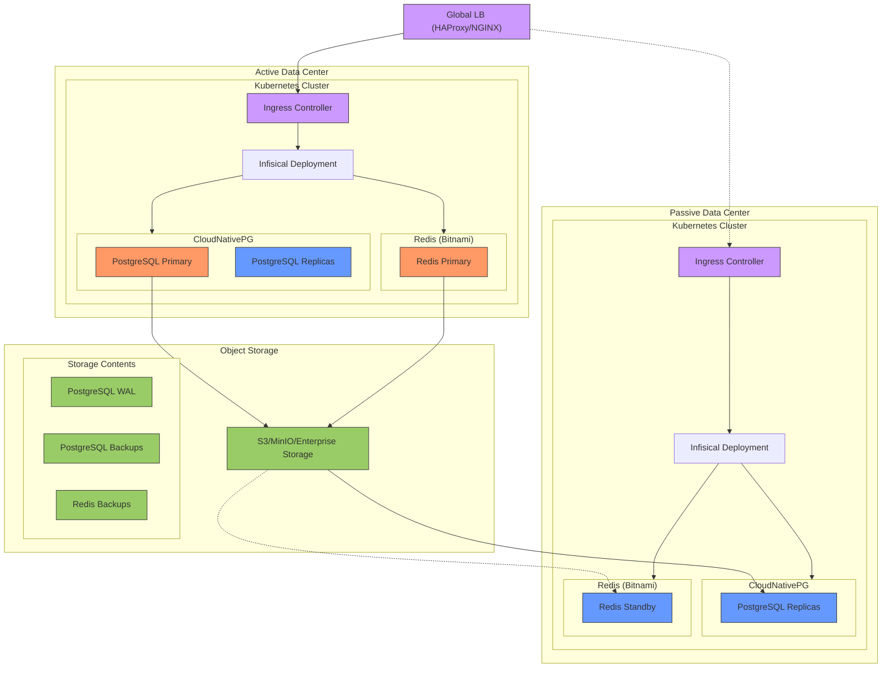

Deploying Infisical on-premise with high availability requires expertise in networking, container orchestration, and database management. 
This guide serves as a reference architecture and a starting point. Actual deployments may vary depending on your organization's existing infrastructure and capabilities.


## Architecture Overview
{/*  */}

The architecture above makes use of Kubernetes for orchestrating both stateless and stateful components.
The architecture spans multiple data centers for increased redundancy, availability and disaster recovery capabilities using an active-passive configuration.

### Stateful vs stateless workloads
While managing databases within Kubernetes has typically been complex, modern operators like [CloudNativePG](https://cloudnative-pg.io/) simplify this process by handling storage provisioning, persistent volume management, and backup/recovery processes. 
However, if you lack deep expertise in Kubernetes operators or database management, we recommend a hybrid approach where the database is on a managed service for production deployments.

<Warning>
    Managing stateful components like databases can be challenging without deep expertise or a dedicated in-house database management team. 
    To simplify operations and reduce complexity, we recommend offloading databases to managed services from AWS/GCP. 
    These managed services automatically handle provisioning, scaling, failover, backups and rollbacks.
</Warning>

## Core Components
### Kubernetes Cluster
Infisical is deployed on a Kubernetes cluster, which allows for container management, auto-scaling, and self-healing capabilities. 
A load balancer sits in front of the Kubernetes cluster, directing traffic and making sure there is an even load distribution across the application nodes.
This is the entry point where all other services will interact with Infisical.

### Object Storage
The architecture requires S3-compatible object storage for database backups and cross-datacenter replication. This can be provided by:
- Existing enterprise object storage solution
- Dedicated MinIO deployment
- In-cluster MinIO deployment if neither option above is available

The object storage must be accessible from all Kubernetes clusters and provides:
- Storage for PostgreSQL WAL archiving and backups
- Storage for Redis backups

### CloudNativePG for High Availability PostgreSQL
The database layer is powered by PostgreSQL, managed by CloudNativePG operator for high availability:
- **Redundancy:** CloudNativePG manages a primary-replica setup where the primary handles write operations and replicas handle read operations
- **Failover:** The operator automatically handles failover within a cluster by promoting a replica to primary when needed
- **Backup and Recovery:** Built-in support for backup to S3-compatible storage with point-in-time recovery capabilities

### Redis High Availability
Redis is deployed using the [Bitnami Helm chart](https://github.com/bitnami/charts/tree/main/bitnami/redis) in a simple primary configuration:
- Single Redis instance per cluster without streaming replication
- Regular backups to object storage
- Restore from backup during failover

<Note>
Infisical does not support Redis cluster mode, and since this is an active-passive setup, we use a simple Redis deployment with backup/restore for failover.
</Note>

#### PostgreSQL Backup and Restore
PostgreSQL is the single source of truth for nearly all application data on Infisical.

CloudNativePG provides well defined backup and restore capabilities:
- **Continuous Backup:** The operator continuously archives WAL files to object storage
- **Point-in-Time Recovery:** Supports restoring to any point in time using WAL archiving
- **Regular Testing:** Periodically test backup restoration to exercise the full lifecycle of this process

#### Redis Backup and Restore
Each Redis instance is backed up through a Kubernetes CronJob that:
1. Executes the Redis `SAVE` command
2. Copies the resulting `dump.rdb` to object storage
3. Manages backup retention

<Accordion title="Example Redis backup CronJob">
    ```yaml
    apiVersion: batch/v1
    kind: CronJob
    metadata:
    name: redis-backup
    spec:
    schedule: "0 * * * *"  # Every hour
    jobTemplate:
        spec:
        template:
            spec:
            containers:
            - name: redis-backup
                image: bitnami/redis
                command:
                - /bin/sh
                - -c
                - |
                redis-cli -a $REDIS_PASSWORD save
                mc cp /data/dump.rdb object-store/redis-backups/
            volumes:
            - name: redis-data
                persistentVolumeClaim:
                claimName: redis-data
    ```
</Accordion>

During failover, the latest Redis backup is restored from object storage to the passive data center. This process is manual and requires operator intervention.

## Multi Data Center Deployment
Infisical can be deployed across multiple data centers in an active-passive configuration for disaster recovery. In this setup, one data center serves as the active site while others remain as passive standbys.

### Active Data Center 
The active data center contains:
- The primary PostgreSQL cluster managed by CloudNativePG handling all write operations
- The active Redis instance handling all traffic
- The active Infisical deployment serving all user traffic

### Passive Data Centers
Passive data centers act as disaster recovery sites. Each contains:
- A replica PostgreSQL cluster that replicates from the active site's primary cluster
- A standby Redis instance (not receiving traffic)
- A standby Infisical deployment (not receiving traffic)

### Traffic Management and Failover
Traffic routing between data centers requires:
1. A global load balancer for traffic management. For on-premises deployments, this can be implemented using:
   - HAProxy or NGINX configured as a global load balancer
   - Any enterprise network routing solutions you may already have in place
2. Each data center should have its own ingress or load balancer

The global load balancer should be deployed in a highly available configuration across multiple locations to avoid it becoming a single point of failure.

During normal operation:
- The global load balancer routes all traffic to the active data center
- Replica PostgreSQL clusters continuously replicate from the primary cluster
- Redis backups are regularly created and stored in object storage

During failover:
- A human operator must initiate the failover process
- The operator promotes a replica PostgreSQL cluster in the target passive data center to become primary using CloudNativePG's promotion process
- The latest Redis backup is restored from object storage to the passive data center's Redis instance
- Once database failover is complete, the global load balancer is updated to direct traffic to the new active data center

<Note>
This is an active-passive setup where failover must be initiated manually by an operator. Automatic failover between data centers is not recommended as it can lead to split-brain scenarios. The operator should verify the state of both data centers before initiating failover.
</Note>

## Data Replication Across Data Centers

### PostgreSQL Replication
CloudNativePG manages replication across data centers:
- **Replica Clusters:** Each data center runs a replica cluster that replicates from the primary cluster
- **WAL Shipping:** Changes are replicated via WAL shipping to object storage
- **Failover:** The operator can promote a replica cluster to primary during planned switchovers or failures

### Object Storage Configuration
If using MinIO for object storage, ensure:
- High availability deployment if running dedicated MinIO cluster
- Proper access controls and encryption for data at rest
- Regular monitoring of storage capacity and performance
- Backup of object storage data itself if running your own MinIO deployment