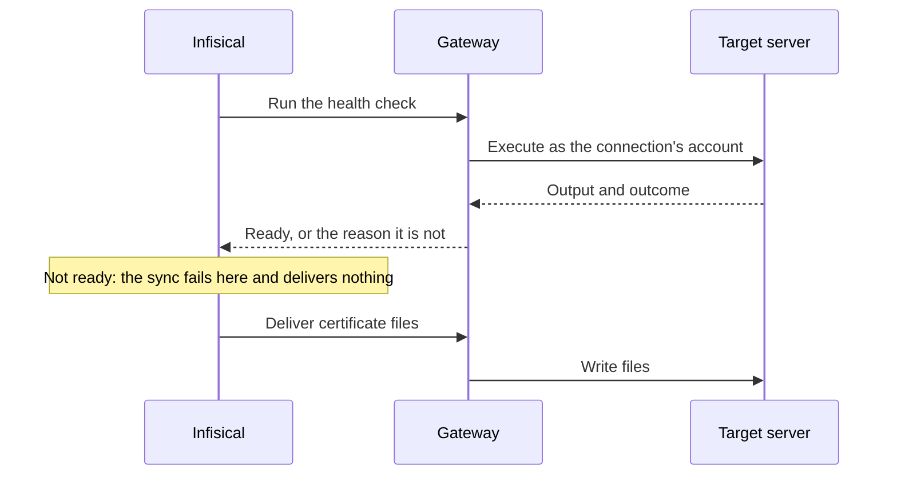

The check runs on the target server, not on Infisical, and gates everything after it:

```mermaid
sequenceDiagram
    participant I as Infisical
    participant G as Gateway
    participant S as Target server
    I->>G: Run the health check
    G->>S: Execute as the connection's account
    S-->>G: Output and outcome
    G-->>I: Ready, or the reason it is not
    Note over I: Not ready: the sync fails here and delivers nothing
    I->>G: Deliver certificate files
    G->>S: Write files
```
