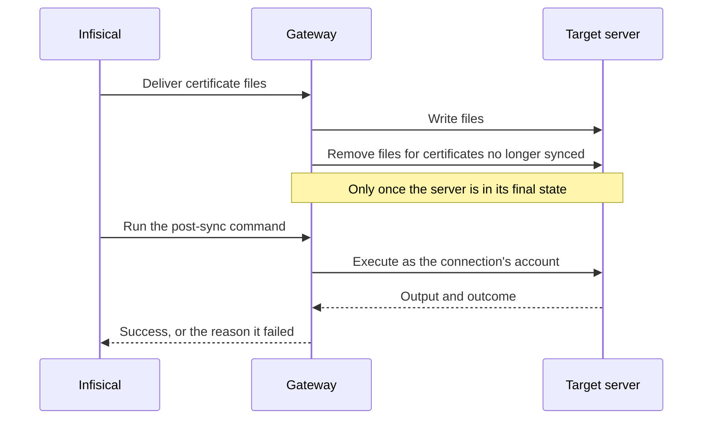

The command runs on the target server, not on Infisical, and only after the whole delivery has finished:

```mermaid
sequenceDiagram
    participant I as Infisical
    participant G as Gateway
    participant S as Target server
    I->>G: Deliver certificate files
    G->>S: Write files
    G->>S: Remove files for certificates no longer synced
    Note over G,S: Only once the server is in its final state
    I->>G: Run the post-sync command
    G->>S: Execute as the connection's account
    S-->>G: Output and outcome
    G-->>I: Success, or the reason it failed
```
