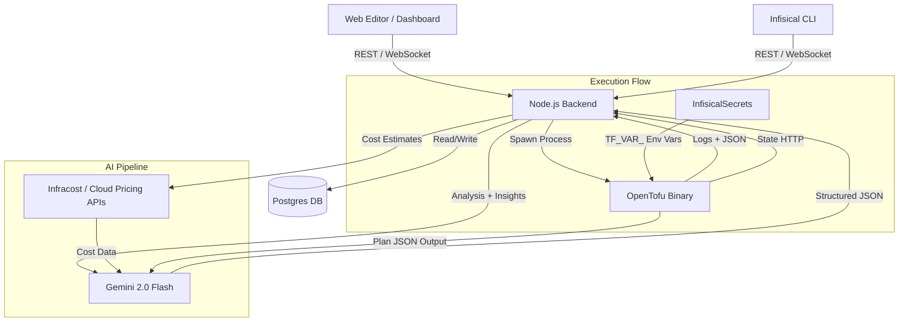

# Infisical Infra — Design Document

**Context:** Infisical Infra is an embedded Infrastructure-as-Code (IaC) platform within the Infisical dashboard. Users manage OpenTofu configurations via a web editor or the Infisical CLI, with state fully managed in the cloud.

**Core Philosophy:** State is never exposed to the user. Whether using the web editor or CLI, all planning and applying happens server-side. One project equals one infrastructure state.

## 1. High-Level Architecture



### Key Principle: Cloud-Only Execution

Users never run `tofu` locally. The Infisical backend is the sole execution environment.

- **Web Editor:** Edit files in-browser with Monaco, click Plan/Apply. Output streams via WebSocket.
- **CLI:** `infisical infra plan` / `infisical infra apply` pushes local `.tf` files to the cloud, triggers server-side execution, and streams output back to the terminal.

Both paths hit the **same API endpoints**. The CLI uploads files from the local working directory, then triggers a run — identical to clicking Plan/Apply in the web editor.

## 2. Tech Stack & Dependencies

| Layer | Technology |
|-------|-----------|
| Frontend | React, `@monaco-editor/react` (local bundle), `recharts`, TanStack Query |
| Backend | Node.js (TypeScript), Fastify, `child_process` |
| Database | PostgreSQL (Knex migrations) |
| IaC Engine | OpenTofu (v1.6+) installed on the host |
| AI Engine | Google Gemini API (`gemini-2.0-flash`) via `GEMINI_API_KEY` env var |
| Cost Estimation | Infracost API or cloud pricing APIs (AWS, GCP, Azure) |
| CLI | Infisical CLI (Go, in `cli/` repo) |

## 3. Data Models

All tables are attached directly to the `Project` entity. No workspace abstraction.

### `infra_files`

Stores `.tf` files in the database. Shared between web editor and CLI.

| Column | Type | Notes |
|--------|------|-------|
| `id` | UUID | Primary key |
| `projectId` | UUID | FK → `projects.id` |
| `name` | VARCHAR | e.g. `main.tf`, `variables.tf` |
| `content` | TEXT | File content, default `""` |
| `createdAt` | TIMESTAMPTZ | Auto |
| `updatedAt` | TIMESTAMPTZ | Auto via trigger |

**Unique constraint:** `(projectId, name)`

### `infra_states`

Stores the OpenTofu JSON state blob. One state per project, never exposed to users.

| Column | Type | Notes |
|--------|------|-------|
| `id` | UUID | Primary key |
| `projectId` | UUID | FK → `projects.id`, unique |
| `content` | JSONB | Full `terraform.tfstate` JSON |
| `createdAt` | TIMESTAMPTZ | Auto |
| `updatedAt` | TIMESTAMPTZ | Auto via trigger |

**Note:** No `lockId` column. Concurrency is enforced at the service level — the backend rejects new runs while one is in progress for a project (or queues them). Since all execution is cloud-only, we control this entirely in-process.

### `infra_runs`

Audit log of every plan and apply execution.

| Column | Type | Notes |
|--------|------|-------|
| `id` | UUID | Primary key |
| `projectId` | UUID | FK → `projects.id` |
| `type` | VARCHAR | `plan` or `apply` |
| `status` | VARCHAR | `pending`, `running`, `success`, `failed`, `awaiting_approval` |
| `logs` | TEXT | Full stdout/stderr |
| `planJson` | JSONB | Nullable, parsed plan output (resource_changes) |
| `aiSummary` | TEXT | Nullable, structured AiInsight JSON |
| `fileSnapshot` | JSONB | Nullable, snapshot of files at run time for diff view |
| `triggeredBy` | UUID | Nullable, FK → `users.id` |
| `planRunId` | UUID | Nullable, FK → `infra_runs.id` — links an apply to its preceding plan |
| `createdAt` | TIMESTAMPTZ | Auto |
| `updatedAt` | TIMESTAMPTZ | Auto via trigger |

**Key fields:**
- `planJson` — Parsed programmatically from `tofu show -json` output. Contains `resource_changes` array with action, type, name, before/after values. No AI needed for change detection.
- `aiSummary` — Structured `AiInsight` JSON (costs, security, summary). Generated by AI pipeline.
- `fileSnapshot` — Stores `{name: content}` map of all files at the time of the run, enabling GitHub-style diffs on the run detail page.
- `planRunId` — When an apply reuses a cached plan insight, this links back to the plan run.

## 4. API Endpoints

**Prefix:** `/api/v1/infra`

All authenticated endpoints require JWT auth (`AuthMode.JWT`).

### File Management

| Method | Path | Auth | Description |
|--------|------|------|-------------|
| `GET` | `/:projectId/files` | JWT | List all `.tf` files (returns `{files, checksums}`) |
| `POST` | `/:projectId/files` | JWT | Create or update a file (`{name, content}`) |
| `DELETE` | `/:projectId/files/:name` | JWT | Delete a file |
| `GET` | `/:projectId/files/checksums` | JWT | Get file checksums only (for sync detection) |
| `POST` | `/:projectId/files/pull` | JWT | Download all files (`{files: [{name, content}]}`) |

### Run Execution

| Method | Path | Auth | Description |
|--------|------|------|-------------|
| `POST` | `/:projectId/run` | JWT | Trigger plan or apply (sync, `{mode}`) |
| `GET` | `/:projectId/run/stream` | JWT | WebSocket — stream plan/apply in real-time |
| `GET` | `/:projectId/runs` | JWT | List run history (paginated: `?limit=50&offset=0`) |
| `GET` | `/:projectId/runs/:runId` | JWT | Get single run with full logs, AI summary, file snapshot |
| `POST` | `/:projectId/runs/:runId/approve` | JWT | Approve a run that is `awaiting_approval` |
| `POST` | `/:projectId/runs/:runId/deny` | JWT | Deny a run that is `awaiting_approval` |

### State Backend (OpenTofu HTTP backend protocol — internal only)

Called by the child `tofu` process during execution. No auth — only reachable during server-side runs.

| Method | Path | Auth | Description |
|--------|------|------|-------------|
| `GET` | `/:projectId/state` | None | Retrieve state JSON or 404 |
| `POST` | `/:projectId/state` | None | Upsert state JSON |

**Lock/unlock endpoints are removed.** Since all execution is cloud-only, concurrency is enforced at the service level before spawning the process. OpenTofu's backend config uses `skip_lock = true`.

## 5. Component Logic

### A. State Backend

Infisical acts as the remote HTTP backend for OpenTofu. State is **never** stored locally or exposed to users — it lives exclusively in Postgres.

During each run, the service generates a `backend_override.tf` file:

```hcl
terraform {
  backend "http" {
    address    = "https://<SITE_URL>/api/v1/infra/<projectId>/state"
    skip_lock  = true
  }
}
```

No lock/unlock endpoints needed — the backend prevents concurrent runs per project at the service layer.

### B. Concurrency Control

Instead of state locking, the service maintains a per-project run guard:

```typescript
// In-memory set of currently running project IDs
const activeRuns = new Set<string>();

// Before starting a run:
if (activeRuns.has(projectId)) {
  throw new ConflictError("A run is already in progress for this project");
}
activeRuns.add(projectId);

// After run completes (success or failure):
activeRuns.delete(projectId);
```

The web editor and CLI show a clear message when a run is already in progress.

### C. Runner (Execution Engine)

The runner handles both plan and apply. The key insight: **plan is the primary operation**. Apply is just "execute the plan."

#### Plan Flow

1. **Guard** — Check no other run is in progress for this project.
2. **Create run record** — Status `running`, type `plan`.
3. **Snapshot files** — Store current `{name: content}` map in `fileSnapshot`.
4. **Write files to temp dir** — Fetch all `InfraFile` records, write to `/tmp/infra-<runId>-*/`.
5. **Generate backend config** — Write `backend_override.tf`.
6. **Execute:**
   - `tofu init -no-color`
   - `tofu plan -no-color -out=plan.tfplan`
   - `tofu show -json plan.tfplan` → parse `resource_changes` into `planJson`
7. **Stream output** — Each chunk goes to `onData` callback.
8. **Parse changes programmatically** — Extract `resource_changes` from the JSON output. This gives us exact add/change/destroy counts and resource details with zero AI cost.
9. **AI analysis** — Feed the plan output + cost API estimates to Gemini. Get back `AiInsight` JSON (costs, security, summary). See AI Agent section.
10. **Cache insight** — Store `planJson` and `aiSummary` on the run record.
11. **Finalize** — Update run status to `success`. Clean up temp dir.

#### Apply Flow

1. **Guard** — Check no other run is in progress.
2. **Create run record** — Status `running`, type `apply`, with `planRunId` pointing to the preceding plan if applicable.
3. **Check for cached plan insight** — If the most recent plan's `aiSummary` has `security.shouldApprove === true`:
   - Set run status to `awaiting_approval`.
   - Stream the security issues to the client.
   - **Wait for approval** via the `/approve` or `/deny` endpoint.
   - If denied, mark run as `failed` and stop.
4. **Snapshot files** and write to temp dir (same as plan).
5. **Execute:**
   - `tofu init -no-color`
   - `tofu apply -auto-approve -no-color`
6. **Parse changes** from output.
7. **AI analysis** — If a cached plan insight exists and files haven't changed, reuse it. Otherwise, generate fresh.
8. **Finalize** — Update run with status, logs, `aiSummary`.

#### The Approval Gate

The approval gate only triggers for `apply` when the most recent plan's AI detected critical/high security issues (`shouldApprove: true`).

**Web Editor:**
- Shows a modal: "AI detected security issues. Review and approve?"
- Displays the security findings with severity badges.
- "Approve" button hits `POST /runs/:runId/approve`, "Deny" hits `POST /runs/:runId/deny`.

**CLI:**
- Prints security issues in the terminal with color-coded severity.
- Prompts: `Security issues detected. Continue with apply? [y/N]`
- `y` sends approve, anything else sends deny.

### D. File Sync Detection

The CLI and web editor need to know when local/cloud files are out of sync.

**Mechanism:** The `GET /:projectId/files/checksums` endpoint returns a map of `{filename: sha256(content)}` for all cloud files.

**CLI usage:**
1. Before uploading, CLI computes checksums of local `.tf` files.
2. Calls the checksums endpoint.
3. Compares:
   - Files in local but not cloud → will be uploaded (new)
   - Files in cloud but not local → warns "cloud has files not present locally" (yellow warning)
   - Files with different checksums → will be uploaded (modified)
   - Files with matching checksums → skipped (no upload needed)
4. Shows a summary: `2 files to upload, 1 file only in cloud, 3 files unchanged`

**Web Editor:** Auto-pulls latest from the API on mount and on focus (when user switches back to the tab). No manual sync needed.

**Pull endpoint:** `POST /:projectId/files/pull` returns all files, allowing the CLI to download cloud files to local: `infisical infra pull`.

### E. AI Agent

The AI agent produces a **structured JSON response**. Change detection is done programmatically — the AI focuses on cost estimation, security analysis, and human-readable summary.

#### What's Programmatic vs AI

| Concern | Method | Why |
|---------|--------|-----|
| Resource changes (add/change/destroy) | **Programmatic** — parse `tofu show -json` output | 100% accurate, instant, free |
| Cost estimation (AWS/GCP/Azure covered) | **API** — Infracost or cloud pricing APIs | Accurate for supported resources |
| Cost estimation (uncovered resources) | **AI** — Gemini estimates | Covers the long tail |
| Security analysis | **AI** — Gemini with plan context | Requires reasoning about configurations |
| Human-readable summary | **AI** — Gemini | Natural language generation |
| Approval gate decision | **AI** — `shouldApprove` flag | Requires judgment on severity |

#### AI Input

The AI receives:
1. The plan output (human-readable, truncated to 15k chars)
2. The parsed `resource_changes` JSON (programmatic, exact)
3. Cost estimates from the pricing API (if available)

It does NOT receive raw state (which may contain secrets).

#### AI Response Schema (`AiInsight`)

```typescript
interface AiInsight {
  // Human-readable markdown summary of changes
  summary: string;

  // Cost breakdown
  costs: {
    // Resources with API-backed estimates
    estimated: Array<{ resource: string; monthlyCost: string; source: string }>;
    // Resources estimated by AI (no API coverage)
    aiEstimated: Array<{ resource: string; monthlyCost: string; confidence: "high" | "medium" | "low" }>;
    totalMonthly: string;
    deltaMonthly: string; // Change from current spend
  };

  // Security findings
  security: {
    issues: Array<{
      severity: "critical" | "high" | "medium" | "low";
      resource: string;
      description: string;
      recommendation: string;
    }>;
    // If true, apply requires user confirmation before proceeding
    shouldApprove: boolean;
  };
}
```

**Note:** `changes` (add/change/destroy counts and resource list) is NOT in the AI response. It's parsed programmatically from `planJson` and stored separately on the run record. This saves AI compute and is 100% accurate.

#### System Prompt

```
You are a DevOps and security expert embedded in Infisical Infra. You will receive:
1. OpenTofu plan output (human-readable)
2. Parsed resource changes (JSON, programmatic — already extracted, do not repeat)
3. Cost estimates from pricing APIs (if available)

Produce a JSON response matching this exact schema:
{
  "summary": "...",        // Markdown, under 200 words, focus on what matters
  "costs": { ... },        // See schema above
  "security": { ... }      // See schema above
}

Rules:
- For costs: use provided API estimates for covered resources. For uncovered resources,
  estimate based on typical cloud pricing and set confidence level.
- For security: flag networking misconfigurations, overly permissive access, unencrypted
  data stores, exposed credentials, missing logging/monitoring.
- Set shouldApprove to true ONLY for critical or high severity security issues.
- Output valid JSON only. No markdown fences, no extra text.
```

#### Plan vs Apply

- **Plan:** Always runs the full AI pipeline. The insight is cached on the run record (`aiSummary` + `planJson`). This is the "enhanced plan" — users see changes, costs, and security issues immediately.
- **Apply:** Before executing, checks the most recent plan's cached `aiSummary`. If `shouldApprove` is true, pauses for approval. If the plan is stale (files changed since), re-runs plan first. After apply completes, optionally refreshes the AI summary with post-apply state.

## 6. CLI Integration

The Infisical CLI (`infisical infra`) provides local-IDE users the same capabilities as the web editor.

### Commands

```bash
# Plan — sync local files to cloud, trigger server-side plan, stream output + AI insights
infisical infra plan [--project-id <id>]

# Apply — sync local files to cloud, trigger server-side apply, stream output
# (will pause for approval if AI flags security issues)
infisical infra apply [--project-id <id>]

# Pull — download cloud files to local directory
infisical infra pull [--project-id <id>]
```

### CLI Plan Flow

```
$ infisical infra plan

Syncing files...
  main.tf          modified (uploading)
  variables.tf     unchanged (skipping)
  outputs.tf       new (uploading)
  ⚠ provider.tf    exists in cloud but not locally

Uploaded 2 files, skipped 1, 1 cloud-only file.

Running plan...
[tofu output streams here in real-time]

─── AI Insights ──────────────────────────
Changes: +3 added, ~1 changed, -0 destroyed
  + aws_instance.web
  + aws_security_group.web_sg
  + aws_eip.web_ip
  ~ aws_s3_bucket.data (tags changed)

Estimated Cost: $47.20/mo (+$32.40)
  aws_instance.web       $34.56/mo  (AWS pricing)
  aws_eip.web_ip          $3.60/mo  (AWS pricing)
  aws_s3_bucket.data      $9.04/mo  (AI estimate, high confidence)

⚠ Security Issues:
  [HIGH] aws_security_group.web_sg — ingress allows 0.0.0.0/0 on port 22
         Recommendation: restrict SSH access to known IP ranges
──────────────────────────────────────────
```

### CLI Apply Flow (with approval gate)

```
$ infisical infra apply

Syncing files...
  [same sync output as plan]

⚠ Security issues detected in latest plan:
  [HIGH] aws_security_group.web_sg — ingress allows 0.0.0.0/0 on port 22

Continue with apply? [y/N]: y

Running apply...
[tofu output streams here]

Apply complete. 3 added, 1 changed, 0 destroyed.
```

### Sync Detection Warning

When local files differ from cloud files, the CLI shows a yellow warning:

```
⚠ provider.tf exists in cloud but not locally
  Use 'infisical infra pull' to download cloud files
```

This prevents accidental overwrites when the web editor and CLI are used on the same project.

### Key Design Decisions

- **CLI sends local files to the cloud.** The CLI does NOT run `tofu` locally.
- **Same endpoints as web editor.** No separate CLI-specific API.
- **Auth via CLI token.** Uses existing Infisical auth mechanism (service token or machine identity).
- **Pull command** allows downloading cloud files to sync the other direction.

## 7. Frontend Pages

### Dashboard (`/infra`)

Overview page with live statistics computed from real API data:
- Stat cards: file count, total runs, failed runs, last run time
- Run activity chart (7-day area chart via recharts)
- File type breakdown (pie chart)
- AI insights panel showing the latest run's AI summary
- Recent runs list with status badges

### Editor (`/infra/editor`)

VSCode-style layout:
- **Left sidebar:** File explorer with create, rename, delete operations
- **Center:** Monaco editor (local bundle, no CDN) with HCL syntax, file tabs
- **Bottom:** Resizable console panel with Plan/Apply buttons, real-time output streaming, AI insight sidebar
- **Auto-save:** 1-second debounce to the file API
- **Approval modal:** When AI flags security issues during apply, shows a modal with findings and approve/deny buttons

### Runs (`/infra/runs`)

Run history table with:
- Status badges (success/failed/running/awaiting_approval)
- Run type (plan/apply)
- Relative timestamps
- Expandable AI summary per run
- Click-through to individual run detail page

### Run Detail (`/infra/runs/:runId`)

Detailed view of a single run:
- **Code diff** — GitHub-style diff of file changes (from `fileSnapshot`), showing before/after
- **Resource changes** — Parsed from `planJson` (programmatic, not AI): add/change/destroy with resource types and names
- **Full logs** — Scrollable log output
- **AI Insight panel** — Costs (with API vs AI-estimated breakdown), security findings with severity, human summary
- **Approval status** — If the run required approval, shows who approved/denied and when

## 8. Implementation Status

### Completed

- [x] Database migration for `infra_files`, `infra_states`, `infra_runs`
- [x] Zod schemas and Knex type registration (`knex.d.ts`)
- [x] DALs for all 3 tables (using `ormify`)
- [x] Service layer: file CRUD, run management, state backend, runner, basic AI summary
- [x] Router: file, run, state, and streaming endpoints
- [x] Service wiring in `routes/index.ts`
- [x] Frontend API hooks (TanStack Query): `useInfraFiles`, `useInfraRuns`, `useUpsertInfraFile`, `useDeleteInfraFile`, `useTriggerInfraRun`
- [x] Dashboard page with live stats, charts, AI insights
- [x] Editor page with Monaco, file sidebar, auto-save, plan/apply with AI summary
- [x] Runs page with run history and expandable AI summaries
- [x] Full type safety — backend and frontend type checks pass

### TODO

- [ ] **Migration update:** Add `planJson`, `fileSnapshot`, `planRunId` columns to `infra_runs`. Remove `lockId` from `infra_states`.
- [ ] **Remove lock/unlock endpoints** from router and service. Add concurrency guard (in-memory active run set).
- [ ] **Programmatic change parsing:** Run `tofu show -json` after plan, parse `resource_changes` into `planJson`.
- [ ] **AI Agent v2:** Upgrade to structured `AiInsight` JSON with cost estimation + security analysis (no `changes` — that's programmatic).
- [ ] **Cost Estimation API:** Integrate Infracost or direct cloud pricing APIs.
- [ ] **Approval gate:** Add `awaiting_approval` status, `/approve` and `/deny` endpoints, web editor modal, CLI prompt.
- [ ] **File checksums endpoint:** `GET /:projectId/files/checksums` for sync detection.
- [ ] **File pull endpoint:** `POST /:projectId/files/pull` for CLI download.
- [ ] **File snapshots:** Save `fileSnapshot` on run creation for the diff view.
- [ ] **CLI commands:** `infisical infra plan`, `infisical infra apply`, `infisical infra pull` in the CLI repo.
- [ ] **Run detail page:** Individual run view with code diff, logs, AI insight panel, resource changes.
- [ ] **Plan caching:** Reuse plan AI insight for immediate apply if files haven't changed.
- [ ] **Secret injection:** Connect to existing SecretService to inject `TF_VAR_` env vars into tofu runs.
- [ ] **Permissions/RBAC:** Integrate with Infisical's CASL permission system.
- [ ] **Concurrency guard:** In-memory `activeRuns` set to prevent parallel runs per project.
- [ ] **Run cancellation:** Allow aborting an in-progress run.

## 9. Security & Limitations

- **Isolation:** Runs execute on the host server as child processes. No container sandboxing in MVP.
- **State privacy:** State is stored server-side in Postgres (JSONB). Users never see raw state — only AI-analyzed summaries and programmatic resource change lists. This protects sensitive values embedded in state.
- **Concurrency:** Enforced at the service level with in-memory guard. One run at a time per project.
- **File content:** Stored as plaintext in Postgres. Future: encrypt at rest via KMS service.
- **Auth:** All user-facing endpoints require JWT. State backend endpoints (called by `tofu` child process) are unauthenticated but only reachable during server-side execution.
- **AI inputs:** The AI never receives raw state (which may contain secrets). It only sees plan output and resource change metadata.
